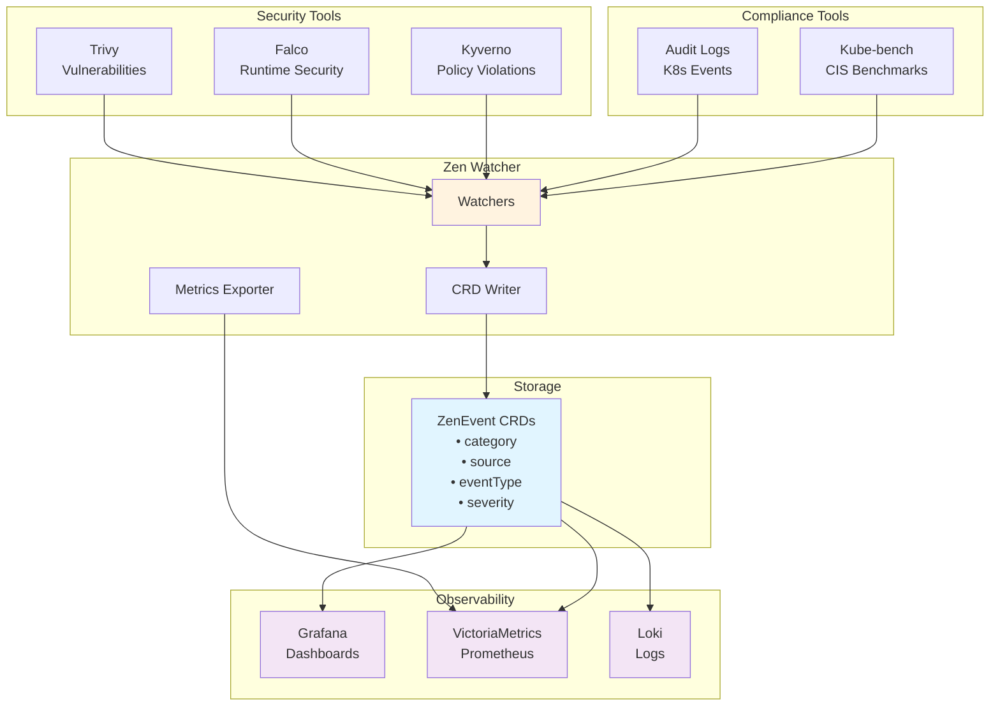

# Zen Watcher

[](https://opensource.org/licenses/Apache-2.0)
[](https://go.dev/)
[](https://kubernetes.io/)
[](https://github.com/your-org/zen-watcher/releases)

> **Universal Kubernetes Event Aggregator - Your Central Hub for Security, Compliance, Performance & Observability**

Zen Watcher is an open-source Kubernetes operator that aggregates events from multiple sources into a unified, extensible CRD-based system. Perfect for teams who want a single point of integration for observability tools like Grafana, Prometheus, and Loki.

---

## 🎯 Features

- **Multi-Source Event Aggregation**: Collects events from:
  - 🛡️ **Security Tools**: Trivy (vulnerabilities), Falco (runtime threats), Kyverno (policy violations)
  - 📋 **Compliance Tools**: Kubernetes Audit Logs, Kube-bench (CIS benchmarks)
  - 🚀 **Extensible**: Add your own tools and event sources

- **CRD-Based Storage**: All events stored as Kubernetes Custom Resources (`ZenEvent`)
  - Easy integration with GitOps workflows
  - Native Kubernetes RBAC support
  - Query with `kubectl` or Kubernetes API

- **Flexible Event Categories** (Extensible):
  - **Security**: Vulnerabilities, runtime threats, policy violations
  - **Compliance**: Audit events, benchmark violations
  - **Performance**: Add your own performance monitoring
  - **Observability**: Custom observability events
  - **Custom**: Any category you need!

- **Comprehensive Monitoring**: Production-ready observability
  - 📊 **20+ Prometheus metrics** (events, performance, health)
  - 🎨 **Beautiful Grafana dashboard** with 16 panels
  - 🚨 **20+ alerting rules** for proactive monitoring
  - 📈 **SLO tracking** for availability and performance
  
- **Observability Ready**: Designed for integration with:
  - Grafana (pre-built dashboard included!)
  - Prometheus / VictoriaMetrics (metrics compatible)
  - Loki (log aggregation)
  - Any tool that can read Kubernetes CRDs

- **Flexible Configuration**:
  - Monitor all tools or specific ones
  - Configurable via environment variables
  - Behavior modes: `all`, `conservative`, `security-only`, etc.

- **Zero External Dependencies**: No Redis, no external services - runs entirely within your cluster

- **Production-Ready Security**:
  - Non-privileged containers
  - NetworkPolicy support
  - Pod Security Standards (restricted)
  - RBAC least-privilege
  - Image signing (Cosign)
  - SBOM generation

---

## 🏗️ Architecture



---

## 🚀 Quick Start

### 🎯 One-Command Demo (Recommended for Evaluation!)

Want to see Zen Watcher in action? Run this single command:

```bash
./hack/quick-demo.sh
```

**What you get**:
- ✅ Complete k3d cluster with all components
- ✅ Trivy, Falco, Kyverno security tools
- ✅ VictoriaMetrics & Grafana
- ✅ Pre-configured dashboard
- ✅ All URLs ready to open

**Time**: ~5 minutes | **Requirements**: `kubectl`, `helm`, `k3d`

**Then open**: http://localhost:3000/d/zen-watcher

---

### Prerequisites

- Kubernetes cluster (1.28+)
- `kubectl` configured
- Helm 3.8+ (optional, for Helm installation)
- Security/compliance tools installed (optional: Trivy, Falco, Kyverno, etc.)

### Option 1: Helm Installation (Recommended)

```bash
# 1. Install with Helm
helm install zen-watcher ./charts/zen-watcher \
  --namespace zen-system \
  --create-namespace \
  --set global.clusterID=my-cluster

# 2. Verify installation
kubectl get pods -n zen-system
kubectl get zenevents -n zen-system
```

### Option 2: kubectl Installation

```bash
# 1. Create namespace
kubectl create namespace zen-system

# 2. Install CRD
kubectl apply -f src/crd/zen_event_crd.yaml

# 3. Deploy Zen Watcher
kubectl apply -f deploy/k8s-deployment.yaml

# 4. Verify installation
kubectl get pods -n zen-system
kubectl logs -n zen-system deployment/zen-watcher
```

### Set up Monitoring (Recommended)

```bash
# 1. Deploy VictoriaMetrics (or use existing Prometheus)
kubectl apply -f deployments/victoriametrics.yaml

# 2. Deploy alert rules
kubectl apply -f config/monitoring/prometheus-alerts.yaml

# 3. Import Grafana dashboard
# Go to Grafana → Import → Upload config/dashboards/zen-watcher-dashboard.json
```

---

## 📊 Usage

### View Events

```bash
# List all events
kubectl get zenevents -n zen-system

# Filter by category
kubectl get zenevents -n zen-system -l category=security
kubectl get zenevents -n zen-system -l category=compliance
kubectl get zenevents -n zen-system -l category=performance  # Your custom events!

# Filter by source
kubectl get zenevents -n zen-system -l source=trivy
kubectl get zenevents -n zen-system -l source=falco

# Filter by severity
kubectl get zenevents -n zen-system -l severity=critical

# View details
kubectl describe zenevent <name> -n zen-system
```

### Query with kubectl

```bash
# Get all critical security events
kubectl get zenevents -n zen-system \
  -l category=security,severity=critical \
  -o json | jq '.items[] | {name: .metadata.name, message: .spec.message, source: .spec.source}'

# Count events by source
kubectl get zenevents -n zen-system -o json | \
  jq -r '.items[] | .spec.source' | sort | uniq -c
```

### API Endpoints

```bash
# Health check
curl http://zen-watcher:8080/health

# Tool status (includes category for each tool)
curl http://zen-watcher:8080/tools/status

# Prometheus metrics
curl http://zen-watcher:8080/metrics
```

---

## 📊 Monitoring & Dashboards

### Grafana Dashboard

**Beautiful, comprehensive dashboard with 16 panels**:

1. **Overview Stats**: Health, Events/sec, Active Events, Critical Events
2. **Event Analysis**: Rate timeline, Category distribution, Severity breakdown
3. **Watcher Health**: Status gauges, Performance metrics, Error tracking
4. **System Resources**: Goroutines, Memory, CPU usage
5. **Operations**: HTTP requests, API latency, CRD performance

**Import**: Upload `config/dashboards/zen-watcher-dashboard.json` in Grafana UI

### Prometheus Metrics

20+ metrics available for monitoring:

```promql
# Event metrics
zen_watcher_events_total              # Total events collected
zen_watcher_active_events             # Active events by category/severity
zen_watcher_events_written_total      # Successfully written events

# Performance metrics
zen_watcher_scrape_duration_seconds         # Watcher performance
zen_watcher_crd_operation_duration_seconds  # CRD write latency
zen_watcher_http_request_duration_seconds   # API latency

# Health metrics
zen_watcher_health_status    # Overall health (1=healthy, 0=unhealthy)
zen_watcher_watcher_status   # Individual watcher status
```

### Alerting

20+ pre-configured alert rules for:
- **Critical**: System down, high event rates, SLO violations
- **Warning**: Resource pressure, slow operations, watcher errors
- **Info**: Configuration notices

**Deploy**: `kubectl apply -f config/monitoring/prometheus-alerts.yaml`

**Full Guide**: See `config/monitoring/README.md`

---

## ⚙️ Configuration

### Environment Variables

| Variable | Description | Default | Example |
|----------|-------------|---------|---------|
| `CLUSTER_ID` | Unique cluster identifier | `my-cluster` | `prod-us-east-1` |
| `WATCH_NAMESPACE` | Namespace for CRDs | `zen-system` | `security-events` |
| `BEHAVIOR_MODE` | Which tools to monitor | `all` | `security-only`, `compliance-only` |
| `TRIVY_NAMESPACE` | Trivy installation namespace | `trivy-system` | `trivy` |
| `FALCO_NAMESPACE` | Falco installation namespace | `falco` | `falco-system` |

### Behavior Modes

- **`all`**: Monitor all available tools (default)
- **`conservative`**: Trivy + Kyverno + Audit (exclude Falco)
- **`security-only`**: Trivy + Falco + Kyverno only
- **`compliance-only`**: Audit + Kube-bench only
- **`trivy-only`**: Only Trivy vulnerability scanning
- **`falco-only`**: Only Falco runtime security

### Helm Configuration

See `helm/zen-watcher/values.yaml` for comprehensive configuration options including:
- Security settings (NetworkPolicy, PSS, RBAC)
- Resource limits
- Monitoring integration
- High availability
- Custom environment variables

---

## 📖 CRD Schema

### ZenEvent

```yaml
apiVersion: zen.kube-zen.com/v1
kind: ZenEvent
metadata:
  name: trivy-vulnerability-1234567890
  namespace: zen-system
  labels:
    category: security              # Extensible!
    source: trivy                   # Extensible!
    event-type: vulnerability       # Extensible!
    severity: critical
spec:
  category: security                # security, compliance, performance, observability, custom
  source: trivy                     # trivy, falco, kyverno, audit, kube-bench, custom
  eventType: vulnerability          # vulnerability, runtime-threat, policy-violation, custom
  message: "CVE-2024-1234 found in nginx:1.19"
  severity: CRITICAL                # CRITICAL, HIGH, MEDIUM, LOW, INFO
  timestamp: "2024-01-15T10:30:00Z"
  priority: 1                       # 1 (highest) to 10 (lowest)
  tags:
    - security
    - trivy
    - vulnerability
    - critical
  metadata:
    cluster_id: prod-us-east-1
    namespace: default
    event_id: trivy-abc123
    detail_cve: CVE-2024-1234
  affectedResources:
    - kind: Deployment
      name: nginx
      namespace: default
status:
  phase: Active                     # Active, Resolved, Acknowledged, Archived
  firstSeen: "2024-01-15T10:30:00Z"
  lastSeen: "2024-01-15T10:30:00Z"
  count: 1
```

**Extensibility**: Categories, sources, and event types are open strings - add your own without modifying the CRD!

---

## 🔗 Observability Integration

### Grafana Dashboard

1. Import `dashboards/zen-watcher-dashboard.json`
2. Configure datasource: Prometheus or VictoriaMetrics
3. Datasource URL: `http://victoriametrics:8428` or `http://prometheus:9090`

**Features**:
- Real-time health monitoring
- Event rate tracking
- Category and severity distribution
- Watcher performance metrics
- Resource usage graphs

### Prometheus / VictoriaMetrics

**ServiceMonitor** (for Prometheus Operator):
```bash
helm install zen-watcher ./charts/zen-watcher \
  --set serviceMonitor.enabled=true
```

**Manual scrape config**:
```yaml
scrape_configs:
  - job_name: 'zen-watcher'
    static_configs:
      - targets: ['zen-watcher.zen-system:8080']
```

### Loki Integration

Collect logs with Promtail:

```bash
kubectl apply -f examples/loki-promtail-config.yaml
```

Query in Loki:
```logql
{namespace="zen-system", app="zen-watcher"}
{namespace="zen-system", category="security"}
```

---

## 🛠️ Development

### Build from Source

```bash
# Clone repository
git clone https://github.com/your-org/zen-watcher.git
cd zen-watcher

# Build
go build -o bin/zen-watcher ./cmd/zen-watcher

# Run locally
export KUBECONFIG=~/.kube/config
export CLUSTER_ID=local-dev
export WATCH_NAMESPACE=zen-system
./bin/zen-watcher
```

### Run Tests

```bash
go test ./pkg/...
go test ./cmd/...
```

### Build Docker Image

```bash
docker build -f build/Dockerfile -t your-registry/zen-watcher:1.0.0 .
docker push your-registry/zen-watcher:1.0.0
```

---

## 🔐 Security

Zen Watcher implements security best practices:

- ✅ Non-privileged containers (runAsNonRoot, no capabilities)
- ✅ Read-only root filesystem
- ✅ NetworkPolicy support (micro-segmentation)
- ✅ Pod Security Standards (restricted profile)
- ✅ RBAC least-privilege
- ✅ Image signing support (Cosign)
- ✅ SBOM generation for supply chain security
- ✅ Seccomp profile (RuntimeDefault)

**Security Documentation**: See `docs/SECURITY.md`

---

## 📚 Documentation

- **README.md** (this file) - Getting started
- **charts/zen-watcher/README.md** - Helm chart documentation
- **docs/SECURITY.md** - Security policy and best practices
- **docs/SBOM.md** - Software Bill of Materials guide
- **docs/COSIGN.md** - Image signing and verification
- **docs/OPERATIONAL_EXCELLENCE.md** - Operations guide
- **monitoring/README.md** - Monitoring setup
- **dashboards/README.md** - Grafana dashboard guide
- **CONTRIBUTING.md** - Contribution guidelines
- **CHANGELOG.md** - Version history

---

## 🤝 Contributing

We welcome contributions! Please see [CONTRIBUTING.md](CONTRIBUTING.md) for details.

1. Fork the repository
2. Create a feature branch (`git checkout -b feature/amazing-feature`)
3. Commit your changes (`git commit -m 'Add amazing feature'`)
4. Push to the branch (`git push origin feature/amazing-feature`)
5. Open a Pull Request

---

## 📝 License

This project is licensed under the Apache License 2.0 - see the [LICENSE](LICENSE) file for details.

---

## 🙏 Acknowledgments

- Built for the Kubernetes community
- Inspired by the need for unified event observability
- Thanks to all contributors and security tool maintainers

---

## 📞 Support

- 📫 **Issues**: [GitHub Issues](https://github.com/your-org/zen-watcher/issues)
- 💬 **Discussions**: [GitHub Discussions](https://github.com/your-org/zen-watcher/discussions)
- 📚 **Documentation**: [Wiki](https://github.com/your-org/zen-watcher/wiki)
- 🔒 **Security**: security@kube-zen.com

---

## 🗺️ Roadmap

- [x] Multi-source event aggregation
- [x] CRD-based storage
- [x] Extensible categories
- [x] Prometheus metrics
- [x] Grafana dashboard
- [x] Alerting rules
- [ ] Event deduplication
- [ ] Multi-cluster support
- [ ] Webhook notifications
- [ ] Event retention policies
- [ ] AI-powered event correlation
- [ ] Custom event sources via plugins

---

## ⭐ Star us on GitHub!

If you find Zen Watcher useful, please consider giving us a star ⭐

---

**Made with ❤️ for the Kubernetes community**
