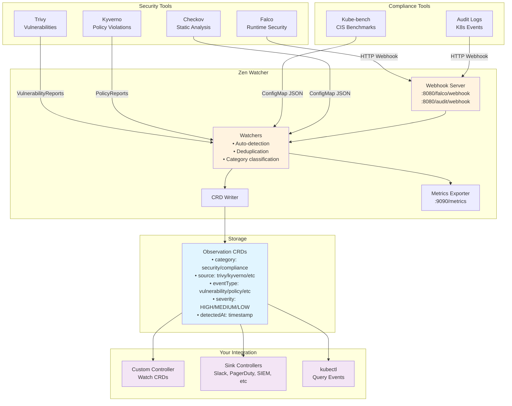
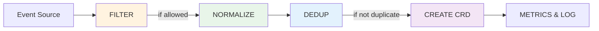

# Zen Watcher

[](https://opensource.org/licenses/Apache-2.0)
[](https://go.dev/)

> **Kubernetes Observation Collector: Turn Any Signal into a CRD**

Zen Watcher is an open-source Kubernetes operator that aggregates structured signals from security, compliance, and infrastructure tools into unified `Observation` CRDs. Lightweight, standalone, and useful on its own.

---

## 🔒 Zero Blast Radius Security: The Core Promise

**Zen Watcher's pure core architecture delivers a critical security guarantee: zero blast radius in the event of compromise.**

### The Security Promise

Because the core component **never holds API keys** for Slack, Splunk, PagerDuty, or any external syncs, a compromise exposes **zero credentials**. This makes the core component **inherently zero trust compliant** and eliminates the need to run it in highly privileged lockdown network zones.

**What this means:**
- ✅ **Zero secrets in core**: The core binary requires zero secrets—secrets live only in optional, isolated sync controllers
- ✅ **Zero egress traffic**: No outbound network traffic, no external dependencies
- ✅ **Zero external dependencies**: All data stored in Kubernetes-native CRDs (etcd)
- ✅ **Active protection**: The security model isn't just passive—it's active protection against credential exposure

### How It Works: Pure Core, Extensible Ecosystem

This follows the proven pattern used by major CNCF projects:

- **Prometheus**: Collects metrics, but doesn't handle alert destination secrets—AlertManager does that
- **Flux**: Reconciles git state, but offloads application operations to other controllers
- **Zen Watcher**: Core only aggregates to etcd—all sensitive external operations live strictly outside that perimeter, managed by separate controllers and RBAC

**Architecture Pattern:**
```
┌─────────────────────────────────────┐
│   Zen Watcher Core (Pure)           │
│   - Zero secrets                    │
│   - Zero egress                     │
│   - Only writes to etcd             │
└──────────────┬──────────────────────┘
               │
               │ Observation CRDs
               │
       ┌───────┴────────┐
       │                │
┌──────▼──────┐  ┌──────▼──────┐
│ kubewatch   │  │ Custom      │
│ Robusta     │  │ Controllers │
│ (Slack,     │  │ (SIEM, etc) │
│  PagerDuty) │  │             │
└─────────────┘  └─────────────┘
(Secrets live here, isolated)
```

This separation ensures that even if the core is compromised, **no credentials can be leaked** because they simply don't exist in the core component.

> 💡 **For compliance-heavy or highly regulated environments**, this zero blast radius guarantee is the primary differentiator. You can deploy zen-watcher core with confidence, knowing that compromise cannot expose external system credentials.

---

## 🚀 Quick Start (4 Minutes to Working System)

**One command gives you a complete demo with all 8 observation sources:**

```bash
# Clone the repo
git clone https://github.com/kube-zen/zen-watcher
cd zen-watcher

# Run automated demo (supports k3d, kind, or minikube - deploys everything, validates 9/9 sources)
./scripts/quick-demo.sh --non-interactive --deploy-mock-data
# Or specify platform: ./scripts/quick-demo.sh kind --non-interactive --deploy-mock-data
# Or: ./scripts/quick-demo.sh minikube --non-interactive --deploy-mock-data

# Demo will show credentials at the end, example:
# Grafana:  http://localhost:8080/grafana/d/zen-watcher
# Username: zen
# Password: <shown in output>
```

**What you get:**
- ✅ Kubernetes cluster (k3d, kind, or minikube) with all 9 security sources (Trivy, Falco, Kyverno, Checkov, KubeBench, Audit, cert-manager, sealed-secrets, Kubernetes Events)
- ✅ VictoriaMetrics + Grafana with 6 pre-built dashboards (Executive, Operations, Security, Main, Namespace Health, Explorer)
- ✅ Mock observations from all 9 sources
- ✅ ~4 minutes total time

**View observations:**
```bash
export KUBECONFIG=~/.kube/zen-demo-kubeconfig
kubectl get observations -A

# By source
kubectl get observations -A -o json | jq -r '.items[] | .spec.source' | sort | uniq -c

# Watch live
kubectl get observations -A --watch
```

**Cleanup:**
```bash
# Use the cleanup script (works with k3d, kind, and minikube)
./scripts/cluster/destroy.sh
# Or specify platform: ./scripts/cluster/destroy.sh kind
# Or: ./scripts/cluster/destroy.sh minikube
```

---

## 🎯 Features

### Multi-Source Event Aggregation (9 Sources - All Working ✅)

Collects events from popular security and compliance tools:
- 🛡️ **Trivy** - Container vulnerabilities (HIGH/CRITICAL) - CRD informer
- 🚨 **Falco** - Runtime threat detection (Warning+) - Webhook
- 📋 **Kyverno** - Policy violations (security policies) - CRD informer
- 🔐 **Checkov** - Static analysis (IaC security) - ConfigMap polling
- 🔍 **Kubernetes Audit Logs** - API server audit events - Webhook
- ✅ **Kube-bench** - CIS benchmark compliance - ConfigMap polling
- 🔒 **cert-manager** - Certificate lifecycle monitoring - CRD informer
- 🔐 **sealed-secrets** - Sealed secret decryption failures - Logs adapter
- 🎯 **Kubernetes Events** - Native cluster events (security-focused) - Events API watcher

### 🎯 Adding New Sources: Just YAML!

**No code required!** Add any new source with a simple YAML configuration using `ObservationSourceConfig` CRD. Zen Watcher supports **four input methods**:

1. **🔍 Logs** - Monitor pod logs with regex patterns
2. **📡 Webhooks** - Receive HTTP webhooks from external tools
3. **🗂️ ConfigMaps** - Poll ConfigMaps for batch results
4. **📋 CRDs (Informers)** - Watch Kubernetes Custom Resource Definitions

**Quick Example - Adding a Source from Logs:**
```yaml
apiVersion: zen.kube-zen.io/v1alpha1
kind: ObservationSourceConfig
metadata:
  name: my-tool-source
spec:
  source: my-tool
  ingester: logs
  logs:
    podSelector: app=my-tool
    patterns:
      - regex: "ERROR: (?P<message>.*)"
        type: error
        priority: 0.8
```

That's it! Apply the YAML and zen-watcher will start collecting observations. See [docs/SOURCE_ADAPTERS.md](docs/SOURCE_ADAPTERS.md) for complete examples.

**✨ Features:**
- Modular adapter architecture (SourceAdapter interface)
- **YAML-only source configuration** - No code changes needed for new integrations
- ObservationFilter CRD for dynamic, Kubernetes-native filtering
- ObservationMapping CRD for generic CRD integration
- Infrastructure-blind design: avoids cluster-unique identifiers (e.g., AWS account ID, GKE project name) while preserving Kubernetes-native context (namespace, name, kind) for RBAC, auditing, and multi-tenancy
- Filter merge semantics (ConfigMap + CRD with comprehensive tests)
- Complete end-to-end automation (quick-demo.sh supports k3d/kind/minikube and validates all 9 sources in ~4 minutes)

### CRD-Based Storage
- All events stored as **Observation** Custom Resources
- Kubernetes-native (stored in etcd)
- kubectl access: `kubectl get observations`
- GitOps compatible
- No external dependencies
- **Native Multi-Consumer Support**: Multiple tools can watch Observation CRDs with zero coordination

### Intelligent Noise Reduction
- **SHA-256 content fingerprinting**: Accurate duplicate detection based on normalized event content
- **Per-source token bucket rate limiting**: Prevents one noisy tool from overwhelming the system
- **Time-bucketed aggregation**: Collapses repeating events within configurable windows
- **LRU eviction**: Efficient memory management even under high load
- **Dynamic processing order**: System automatically switches between `filter_first` and `dedup_first` based on real-time traffic patterns
- **Per-Source Auto-Optimization**: Intelligent system that learns from metrics and automatically optimizes processing strategies per source:
  - Dynamic processing order selection (filter_first, dedup_first, hybrid, adaptive)
  - Adaptive filtering with learning capabilities
  - Adaptive deduplication with window optimization
  - Metrics-driven decision making with confidence scoring
  - Comprehensive Prometheus metrics for all optimization decisions
- **Result**: <100ms CPU spikes and minimal etcd churn—even under firehose conditions

See [docs/INTELLIGENT_EVENT_PIPELINE.md](docs/INTELLIGENT_EVENT_PIPELINE.md) for the complete guide to the intelligent event integrity system, or [docs/DEDUPLICATION.md](docs/DEDUPLICATION.md) for detailed deduplication documentation.

### Comprehensive Observability
- 📊 20+ Prometheus metrics on :9090
- 🎨 3 pre-built Grafana dashboards (Executive, Operations, Security)
- 📝 Structured logging: `2025-11-08T16:30:00.000Z [INFO] zen-watcher: message`
- 🏥 Health and readiness probes

### Production-Ready Features
- Non-privileged containers
- Read-only filesystem
- Minimal footprint (~15MB image, <10m CPU, <50MB RAM)
- Pod Security Standards (restricted)
- **Zero egress**: No outbound network traffic, no external dependencies
- **🔒 Pure Core Security Model**: Core binary requires zero secrets—secrets live only in optional, isolated sync controllers (e.g., for Slack/SIEM). Inspired by Prometheus/Flux/Crossplane.
- Structured logging with correlation IDs
- Comprehensive metrics and health checks
- **Note**: Core features are production-ready. Some alternative code paths may exist for compatibility or future enhancements.

---

## 🤔 Why Zen-Watcher?

### Comparison with Alternatives

| Feature | Zen-Watcher | Falco Sidekick | Kubescape | Native Tools | Custom Exporters |
|---------|-------------|----------------|-----------|--------------|------------------|
| **Unified Event Format** | ✅ Single Observation CRD | ❌ Forward-only | ⚠️ Kubescape format | ❌ Per-tool format | ⚠️ Custom |
| **Multi-Source Aggregation** | ✅ 6+ sources | ❌ Falco only | ⚠️ Limited | ❌ Separate | ⚠️ Manual |
| **Storage** | ✅ CRDs (etcd) | ❌ Requires DB/S3 | ✅ CRDs | ❌ Logs/files | ⚠️ Various |
| **Zero Dependencies** | ✅ Kubernetes only | ❌ DB, Redis, etc. | ✅ | ✅ | ❌ Usually needs DB |
| **Extensibility** | ✅ Adapter + Mapping CRDs | ❌ Hard-coded outputs | ⚠️ Limited | ❌ | ⚠️ Code changes |
| **Dynamic Filtering** | ✅ CRD + ConfigMap | ❌ | ⚠️ Static | ❌ | ❌ |
| **Noise Reduction** | ✅ SHA-256 fingerprinting + per-source rate limiting | ❌ None (raw events) | ⚠️ Basic time window only | ❌ | ❌ |
| **End-to-End Alerting** | ✅ (via sync controllers) | ✅ (built-in) | ✅ (built-in) | ❌ | ⚠️ Custom |
| **Kubernetes-Native** | ✅ Pure K8s patterns | ⚠️ Hybrid | ✅ | ✅ | ⚠️ Varies |
| **No Egress Traffic** | ✅ Cluster-only | ❌ Sends to external | ✅ | ✅ | ❌ Usually |
| **No Secrets Required** | ✅ RBAC only | ❌ Credentials needed | ✅ | ✅ | ❌ Usually |
| **HA / Multiple Replicas** | ✅ Dedup handles it | ⚠️ Complex | ✅ | ✅ | ⚠️ Varies |
| **Learning Curve** | ⚠️ K8s CRDs | ⚠️ Sidekick config | ⚠️ Medium | ✅ Low | ❌ High |

### Key Differentiators

1. **🎯 True Aggregation** - Zen-watcher is the only tool that aggregates multiple security tools into a single, queryable format
2. **🔒 Zero Trust** - No external dependencies, credentials, or egress traffic required
3. **🧩 Extensibility** - ObservationMapping CRDs let you integrate ANY CRD without code changes
4. **📦 Kubernetes-Native** - First-class CRDs, not just a forwarder or exporter
5. **🎨 Modular** - 8 adapters + 1 generic adapter for the "long tail"

### When to Use What

| Use Zen-Watcher If... | Use Alternatives If... |
|----------------------|------------------------|
| You want unified view of all security events | You only use Falco (use Sidekick) |
| You need CRD storage for GitOps | You need external SIEM immediately |
| You want zero external dependencies | You're okay with databases/Redis |
| You need custom CRD integration | You only use standard tools |
| You want Kubernetes-native patterns | You prefer SaaS solutions |

---

## 🏗️ Architecture

**Why Modular?** The modular architecture makes zen-watcher easy to extend and maintain:

- **🎯 Community Contributions**: Add a new processor (`wiz_processor.go`) and register it in `factory.go`—no need to understand the entire codebase.
- **🧪 Testing Made Simple**: Test components in isolation with mocks (`configmap_poller.go` with mock K8s client, `http.go` with `httptest`).
- **🚀 Future-Proof**: New event sources slot into `pkg/watcher/` or create new packages without refactoring.
- **⚡ Low Maintenance**: Orchestrate modules instead of maintaining monolithic code—each component has clear boundaries.



**Key Design:**
- **Watches** multiple security tools
- **Filters** events per-source (ConfigMap-based rules)
- **Normalizes** to standard categories/severities
- **Deduplicates** with sliding window (LRU + TTL)
- **Aggregates** into unified CRD format
- **Stores** in Kubernetes etcd (no external database)
- **Exposes** via standard Kubernetes API
- **Integrates** with anything that can watch CRDs

**Processing Pipeline:**

All events flow through the same centralized pipeline:



**Flow:** `filter() → normalize() → dedup() → create Observation CRD → update metrics & log`

See [docs/ARCHITECTURE.md](docs/ARCHITECTURE.md#2-event-processing-pipeline) for detailed pipeline documentation.

---

## 📦 Installation

### Prerequisites
- Kubernetes 1.26+ (tested on 1.26+)
- kubectl configured
- Security tools installed (optional: Trivy, Falco, Kyverno, etc.)

### Installation via Helm (Recommended)

**The official Helm chart for zen-watcher lives in a separate repository:**

🔗 **[kube-zen/helm-charts](https://github.com/kube-zen/helm-charts)**

See that repository for:
- Chart values and configuration
- Upgrade paths and version notes
- Version compatibility matrix

**Quick Install:**

```bash
# Add Helm repository
helm repo add kube-zen https://kube-zen.github.io/helm-charts
helm repo update

# Install zen-watcher
helm install zen-watcher kube-zen/zen-watcher \
  --namespace zen-system \
  --create-namespace
```

**Next: Deploy a sync controller to forward Observations to your tools (Slack, SIEM, etc.)**

Without a sync controller, events stay in-cluster. For 95% of users, we recommend using [kubewatch](https://github.com/robusta-dev/kubewatch) or [Robusta](https://home.robusta.dev/)—they support 30+ destinations out of the box. See [Integrations Guide](docs/INTEGRATIONS.md) for setup.

**Version Compatibility:**

| Chart Version | App Version (Image Tag) | Kubernetes | Go Version |
|---------------|-------------------------|------------|------------|
| 1.0.0-alpha   | 1.0.0-alpha             | 1.26+      | 1.23+      |

See the [helm-charts repository](https://github.com/kube-zen/helm-charts) for the latest compatibility matrix.

---

## ⚠️ Scaling Constraints & High Availability

Zen Watcher v1.0.0-alpha supports both single-replica and multi-replica deployments. **HA optimization features** are available when `haOptimization.enabled: true` is set in Helm values, providing dynamic deduplication window adjustment, adaptive cache sizing, and load balancing.

### ❌ Why Multi-Replica Fails in v1.x

1. **In-Memory Deduplication**: With HA optimization enabled, deduplication windows are dynamically adjusted and cache sizing is adaptive to prevent duplicate Observations across replicas.

2. **Uncoordinated Garbage Collection**: GC runs on every pod → race conditions and wasted resources.

3. **Duplicated Informers**: Every pod watches the same CRD streams → **2x–3x unnecessary API load**.

### ✅ Approved Scaling Strategy: Namespace Sharding

To scale horizontally:

- Deploy **multiple Zen Watcher instances**.

- Set `WATCH_NAMESPACE=team-a,team-b` per instance.

- Each shard processes a **disjoint set of namespaces** → **no duplication**.

```yaml
# Instance 1
env:
- name: WATCH_NAMESPACE
  value: "prod,prod-staging"

# Instance 2  
env:
- name: WATCH_NAMESPACE
  value: "dev,qa"
```

➡️ See [docs/SCALING.md](docs/SCALING.md) for full guidance.

---

### Manual Installation (Alternative)

For development or custom deployments:

```bash
# 1. Apply CRDs
kubectl apply -f deployments/crds/observation_crd.yaml

# 2. Deploy zen-watcher
kubectl apply -f deployments/zen-watcher.yaml

# 3. Verify
kubectl get pods -n zen-system
kubectl logs -n zen-system deployment/zen-watcher

# 4. Check observations
kubectl get observations -n zen-system
```

---

## ⚙️ Configuration

### Environment Variables

| Variable | Description | Default |
|----------|-------------|---------|
| `WATCH_NAMESPACE` | Namespace to watch | `zen-system` |
| `TRIVY_NAMESPACE` | Trivy operator namespace | `trivy-system` |
| `FALCO_NAMESPACE` | Falco namespace | `falco` |
| `BEHAVIOR_MODE` | Watching behavior | `all` |
| `LOG_LEVEL` | Log level (DEBUG/INFO/WARN/ERROR/CRIT) | `INFO` |
| `METRICS_PORT` | Prometheus metrics port | `9090` |
| `DEDUP_WINDOW_SECONDS` | Default deduplication window in seconds (used if source not in `DEDUP_WINDOW_BY_SOURCE`) | `60` |
| `DEDUP_WINDOW_BY_SOURCE` | Per-source deduplication windows as JSON (e.g., `{"cert-manager": 86400, "falco": 60, "default": 60}`) | - |
| `DEDUP_MAX_SIZE` | Maximum deduplication cache size | `10000` |
| `DEDUP_BUCKET_SIZE_SECONDS` | Time bucket size for deduplication cleanup | `10` (or 10% of window) |
| `DEDUP_MAX_RATE_PER_SOURCE` | Maximum events per second per source (rate limiting) | `100` |
| `DEDUP_RATE_BURST` | Burst capacity for rate limiting | `200` (2x rate limit) |
| `DEDUP_ENABLE_AGGREGATION` | Enable event aggregation in rolling window | `true` |
| `OBSERVATION_TTL_SECONDS` | Default TTL for observations in seconds | `604800` (7 days) |
| `OBSERVATION_TTL_DAYS` | Default TTL for observations in days (fallback) | `7` |
| `GC_INTERVAL` | Garbage collection interval | `1h` |
| `GC_TIMEOUT` | Timeout for garbage collection operations | `5m` |
| `FILTER_CONFIGMAP_NAME` | Filter ConfigMap name | `zen-watcher-filter` |
| `FILTER_CONFIGMAP_NAMESPACE` | Filter ConfigMap namespace | `zen-system` |
| `FILTER_CONFIGMAP_KEY` | Filter ConfigMap data key | `filter.json` |

### Behavior Modes

- `all` - Watch all available tools
- `conservative` - Only confirmed security issues
- `security-only` - Skip compliance tools
- `custom` - Use tool-specific enable flags

### Source-Level Filtering

Zen Watcher supports **per-source filtering** via ConfigMap to reduce noise and cost. Filtering happens **before** normalization, deduplication, and CRD creation.

**Create Filter ConfigMap:**

```bash
kubectl create configmap zen-watcher-filter -n zen-system --from-file=filter.json=filter.json
```

**Filter Configuration Example** (`filter.json`):

```json
{
  "sources": {
    "trivy": {
      "includeSeverity": ["CRITICAL", "HIGH"]
    },
    "kyverno": {
      "excludeRules": ["disallow-latest-tag"]
    },
    "kubernetesEvents": {
      "ignoreKinds": ["Pod", "ConfigMap"]
    },
    "audit": {
      "includeEventTypes": ["resource-deletion", "secret-access", "rbac-change"]
    },
    "falco": {
      "includeNamespaces": ["production", "staging"]
    },
    "kube-bench": {
      "excludeCategories": ["compliance"]
    },
    "checkov": {
      "enabled": false
    }
  }
}
```

**Filter Options (per source):**
- `includeSeverity`: Explicit list of severity levels to include (e.g., `["CRITICAL", "HIGH"]`)
- `minSeverity`: Minimum severity level (CRITICAL, HIGH, MEDIUM, LOW)
- `excludeRules`: List of rule names to exclude (e.g., `["disallow-latest-tag"]` for Kyverno)
- `excludeEventTypes` / `includeEventTypes`: Filter by event type
- `excludeNamespaces` / `includeNamespaces`: Filter by namespace
- `excludeKinds` / `includeKinds`: Filter by resource kind
- `ignoreKinds`: Alias for `excludeKinds` (convenience for kubernetesEvents)
- `excludeCategories` / `includeCategories`: Filter by category
- `enabled`: Enable/disable source (default: true)

**Benefits:**
- Reduces noise and cost
- Prevents cheap scanners (e.g., Trivy LOW) from polluting dataset
- Saves CPU, memory, and disk churn
- Reduces CRD count and agent noise
- Keeps Observations meaningful

**Dynamic Reloading:**
- Filter configuration reloads automatically when the ConfigMap changes
- No restart required - changes take effect within seconds
- Invalid configs preserve the last known good configuration

**Note:** If ConfigMap is not found, zen-watcher defaults to "allow all" (no filtering).

### Advanced Configuration: ObservationSourceConfig CRD

For more advanced configuration per source, use the `ObservationSourceConfig` CRD. This enables:

- **Auto-Optimization**: Automatically optimize processing order and filters
- **Threshold Monitoring**: Set warning and critical thresholds for alerts
- **Processing Order Control**: Configure filter-first vs dedup-first processing
- **Custom Thresholds**: Define custom thresholds against event data

**Quick Example:**

```yaml
apiVersion: zen.kube-zen.io/v1alpha1
kind: ObservationSourceConfig
metadata:
  name: trivy-config
  namespace: zen-system
spec:
  source: trivy
  ingester: informer
  
  # Auto-optimization
  processing:
    order: auto              # auto, filter_first, or dedup_first
    autoOptimize: true       # Enable automatic optimization
  
  # Filtering
  filter:
    minPriority: 0.5         # Ignore LOW severity events
  
  # Deduplication
  dedup:
    window: "1h"
    strategy: fingerprint
  
  # Thresholds for monitoring and alerts
  thresholds:
    observationsPerMinute:
      warning: 100
      critical: 200
    lowSeverityPercent:
      warning: 0.7
      critical: 0.9
    dedupEffectiveness:
      warning: 0.3
      critical: 0.1
```

**Auto-Optimization Features:**

- **Self-Learning**: Analyzes metrics to find optimization opportunities
- **Dynamic Processing Order**: Automatically adjusts filter-first vs dedup-first
- **Actionable Suggestions**: Provides kubectl commands for easy application
- **Impact Tracking**: Measures and reports optimization effectiveness

**Threshold Monitoring:**

- **Observation Rate**: Alert when sources generate too many events
- **Low Severity Ratio**: Detect noise (too many LOW severity events)
- **Deduplication Effectiveness**: Monitor how well deduplication is working
- **Custom Thresholds**: Define thresholds against any event field

**CLI Commands:**

```bash
# Analyze optimization opportunities
zen-watcher-optimize --command=analyze --source=trivy

# Enable auto-optimization
zen-watcher-optimize --command=auto --enable

# View optimization history
zen-watcher-optimize --command=history --source=trivy
```

➡️ See [docs/SOURCE_ADAPTERS.md](docs/SOURCE_ADAPTERS.md) for complete ObservationSourceConfig documentation and [docs/OPTIMIZATION_USAGE.md](docs/OPTIMIZATION_USAGE.md) for auto-optimization guide.

---

## 📈 Scaling

Zen Watcher uses a **single-replica deployment model** by default for predictable semantics.

**Recommended:** Deploy with `replicas: 1` and scale vertically if needed.

**For high-volume deployments:**
- **Namespace sharding** - Deploy multiple instances, each scoped to different namespaces
- **Vertical scaling** - Increase CPU/memory limits

**✅ HA Support:** HPA is enabled by default. With `haOptimization.enabled: true`, HA features ensure proper deduplication and load balancing across replicas.

See [docs/SCALING.md](docs/SCALING.md) for complete scaling strategy, performance envelope, and future roadmap.

---

## 📊 Observability

### Prometheus Metrics (:9090/metrics)

**Observation Processing Metrics:**
- `zen_watcher_observations_created_total{source=...}` - Total Observation CRDs successfully created (by source)
- `zen_watcher_observations_filtered_total{source=...,reason=...}` - Total observations filtered out by source-level filtering (by source and reason)
- `zen_watcher_observations_deduped_total` - Total observations skipped due to deduplication (within sliding window)

**Core Metrics:**
```
zen_watcher_up 1
zen_watcher_events_total 150
zen_watcher_tools_active 5
```

**Per-Tool Metrics:**
```
zen_watcher_trivy_events_total 45
zen_watcher_falco_events_total 23
zen_watcher_kyverno_events_total 67
zen_watcher_audit_events_total 12
zen_watcher_kubebench_events_total 3
```

**Performance:**
```
zen_watcher_crd_write_duration_seconds{quantile="0.5"} 0.012
zen_watcher_crd_write_duration_seconds{quantile="0.99"} 0.045
zen_watcher_watch_errors_total 2
```

### Structured Logging

**Format:**
```
2025-11-08T16:30:00.000Z [INFO ] zen-watcher: Trivy watcher started
2025-11-08T16:30:01.000Z [DEBUG] zen-watcher: Processing vulnerability CVE-2024-001
2025-11-08T16:30:02.000Z [WARN ] zen-watcher: Falco not detected (skipping)
2025-11-08T16:30:03.000Z [ERROR] zen-watcher: Failed to create CRD (will retry)
```

**Levels:** DEBUG, INFO, WARN, ERROR, CRIT

**Configuration:**
```bash
export LOG_LEVEL=INFO  # DEBUG, INFO, WARN, ERROR, CRIT
export LOG_PREFIX=zen-watcher
```

### Health Endpoints

```bash
curl http://localhost:8080/health    # Health check
curl http://localhost:8080/ready     # Readiness probe  
curl http://localhost:9090/metrics   # Prometheus metrics
```

---

## 🔌 Integration Examples

> 🔌 **Need alerts in Slack, PagerDuty, or SIEM?**  
> Zen Watcher writes `Observation` CRDs. **Use [kubewatch](https://github.com/robusta-dev/kubewatch) or [Robusta](https://home.robusta.dev/) to route them to 30+ destinations—no coding required.**  
> See [Integrations Guide](docs/INTEGRATIONS.md) for setup.

### Quick Start

**Want to consume Observations in your code?** See [docs/INTEGRATIONS.md](docs/INTEGRATIONS.md) for:
- ✅ Using kubewatch or Robusta for plug-and-play alerting (recommended)
- ✅ Using Kubernetes informers for real-time event streaming
- ✅ OpenAPI schema reference and sync guidance
- ✅ Complete controller examples with work queues (advanced)

### Basic Examples

**Watch Events with kubectl:**
```bash
# All events
kubectl get observations -n zen-system

# High severity only
kubectl get observations -n zen-system -o json | \
  jq '.items[] | select(.spec.severity == "HIGH")'

# From specific source
kubectl get observations -n zen-system -o json | \
  jq '.items[] | select(.spec.source == "trivy")'
```

**Watch with Informer (Go):**
```go
// See docs/INTEGRATIONS.md for complete example
informer := factory.ForResource(observationGVR).Informer()
informer.AddEventHandler(cache.ResourceEventHandlerFuncs{
    AddFunc: func(obj interface{}) {
        obs := obj.(*unstructured.Unstructured)
        // Process Observation
    },
})
```

**For complete integration guide**, see [docs/INTEGRATIONS.md](docs/INTEGRATIONS.md).

---

## 📈 Resource Usage

### Typical Load (1000 events/day):
- **CPU:** <10m average
- **Memory:** <50MB
- **Storage:** ~2MB in etcd
- **Network:** None (local only)

### Heavy Load (10,000 events/day):
- **CPU:** <20m average
- **Memory:** <80MB
- **Storage:** ~20MB in etcd
- **Network:** None (local only)

---

## 🔧 Building

```bash
# Standard build
go build -o zen-watcher ./cmd/zen-watcher

# Optimized build (production)
go build -ldflags="-w -s" -trimpath -o zen-watcher ./cmd/zen-watcher

# Docker image
docker build -f build/Dockerfile -t zen-watcher:latest .
```

---

## 🐛 Troubleshooting

### Enable Debug Logging
```bash
kubectl set env deployment/zen-watcher LOG_LEVEL=DEBUG -n zen-system
kubectl logs -n zen-system deployment/zen-watcher -f
```

### Check CRDs
```bash
# List all events
kubectl get observations -n zen-system

# Describe specific event
kubectl describe observations <name> -n zen-system

# Watch for new events
kubectl get observations -n zen-system -w
```

### View Metrics
```bash
kubectl port-forward -n zen-system deployment/zen-watcher 9090:9090
curl http://localhost:9090/metrics
```

### Common Issues

**No events being created:**
- Check if security tools are installed: `kubectl get pods -n trivy-system -n falco`
- Enable debug logging: `LOG_LEVEL=DEBUG`
- Check watcher logs for tool detection

**High memory usage:**
- Adjust watch interval: `WATCH_INTERVAL=60s`
- Enable conservative mode: `BEHAVIOR_MODE=conservative`
- Cleanup old events: `kubectl delete observations --field-selector metadata.creationTimestamp<2025-10-01`

---

## 📋 Custom Resource Definitions (CRDs)

The `Observation` CRD is defined in this repository and synced to the Helm charts repository.

- **Canonical location**: `deployments/crds/observation_crd.yaml` (this repository)
- **Helm charts location**: Synced to `helm-charts/charts/zen-watcher/templates/observation_crd.yaml`
- **OpenAPI Schema**: Defined in CRD (`spec.versions[].schema.openAPIV3Schema`)

**To sync CRD changes**: Run `make sync-crd-to-chart` from this repository.

See:
- [docs/CRD.md](docs/CRD.md) - Detailed CRD documentation and sync process
- [docs/INTEGRATIONS.md](docs/INTEGRATIONS.md) - How to consume Observations (kubewatch, Robusta, informers, OpenAPI schema)

---

## 🔌 Deploying a Complete Alerting Pipeline

> **💡 Important**: Zen Watcher writes `Observation` CRDs to etcd. To get alerts in Slack, PagerDuty, or SIEMs, you need a sync controller. For 95% of users, we recommend using [kubewatch](https://github.com/robusta-dev/kubewatch) or [Robusta](https://home.robusta.dev/)—they support 30+ destinations out of the box. See [Integrations Guide](docs/INTEGRATIONS.md) for setup.

**Zen Watcher core stays pure**: Only watches sources → writes Observation CRDs. Zero egress, zero secrets, zero external dependencies.

**But the Observation CRD is a universal signal format** — and that opens the door for others to react to those observations:

### Community-Driven Sink Controllers

You can build lightweight "sink" controllers that:
- Watch the `Observation` CRD
- Filter by category, severity, source, labels, etc.
- Forward to external systems:
  - 📢 **Slack**
  - 🚨 **PagerDuty**
  - 🛠️ **ServiceNow**
  - 📊 **Datadog / Splunk / SIEMs**
  - 📧 **Email**
  - 🔔 **Custom webhooks**

### Example Sink Controller Structure

```go
pkg/sink/
├── sink.go          // interface
├── slack.go         // implements Sink for Slack
├── pagerduty.go      // implements Sink for PagerDuty
└── controller.go    // watches Observations, routes to sinks
```

### Why This Works

1. **Zen Watcher core stays pure**
   - Only watches sources → writes Observation CRs
   - Zero outbound traffic
   - Zero secrets
   - Zero config for external systems

2. **Sink controllers are separate, optional components**
   - Deploy only if needed
   - Use SealedSecrets or external secret managers for credentials
   - Can be built by the community or enterprise users

3. **Creates an ecosystem**
   - "If you can watch a CRD, you can act on it."
   - Enterprise users can build their own sinks without waiting
   - Follows the Prometheus Alertmanager / Flux / Crossplane pattern: core is minimal; ecosystem extends it

**See [CONTRIBUTING.md](CONTRIBUTING.md) for guidelines on building sink controllers.**

---

## 🤝 Contributing

Contributions welcome! See [CONTRIBUTING.md](CONTRIBUTING.md) for guidelines.

---

## 📄 License

Apache License 2.0 - See [LICENSE](LICENSE) for details.

---

**Repository:** [github.com/kube-zen/zen-watcher](https://github.com/kube-zen/zen-watcher)  
**Helm Charts:** [github.com/kube-zen/helm-charts](https://github.com/kube-zen/helm-charts)  
**Version:** 1.0.0-alpha  
**Go Version:** 1.23+ (tested on 1.23 and 1.24)  
**Kubernetes:** Client libs v0.28.15 (tested on clusters 1.26+)  
**Status:** ✅ Alpha release - Core features ready for evaluation
