# Zen Watcher

[](https://opensource.org/licenses/Apache-2.0)
[](https://go.dev/)

> **Kubernetes Security & Compliance Event Aggregator**

Zen Watcher is an open-source Kubernetes operator that aggregates security and compliance events from multiple tools into unified CRDs. Simple, standalone, and useful on its own.

---

## 🎯 Features

### Multi-Source Event Aggregation
Collects events from popular security and compliance tools:
- 🛡️ **Trivy** - Container vulnerabilities
- 🚨 **Falco** - Runtime threat detection  
- 📋 **Kyverno** - Policy violations
- 🔍 **Kubernetes Audit Logs** - API server audit events
- ✅ **Kube-bench** - CIS benchmark compliance

### CRD-Based Storage
- All events stored as **ZenAgentEvent** Custom Resources
- Kubernetes-native (stored in etcd)
- kubectl access: `kubectl get zenagentevents`
- GitOps compatible
- No external dependencies

### Comprehensive Observability
- 📊 20+ Prometheus metrics on :9090
- 🎨 Pre-built Grafana dashboard
- 📝 Structured logging: `2025-11-08T16:30:00.000Z [INFO] zen-watcher: message`
- 🏥 Health and readiness probes

### Production-Ready
- Non-privileged containers
- Read-only filesystem
- Minimal footprint (~15MB image, <10m CPU, <50MB RAM)
- Pod Security Standards (restricted)

---

## 🏗️ Architecture

```mermaid
graph TB
    subgraph "Security Tools"
        A[Trivy<br/>Vulnerabilities]
        B[Falco<br/>Runtime Security]
        C[Kyverno<br/>Policy Violations]
    end
    
    subgraph "Compliance Tools"
        D[Audit Logs<br/>K8s Events]
        E[Kube-bench<br/>CIS Benchmarks]
    end
    
    subgraph "Zen Watcher"
        F[Watchers]
        G[CRD Writer]
        H[Metrics Exporter]
    end
    
    subgraph "Storage"
        I[ZenAgentEvent CRDs<br/>• category<br/>• source<br/>• eventType<br/>• severity]
    end
    
    subgraph "Your Integration"
        J[Custom Controller<br/>Watch CRDs]
        K[Export to System<br/>SIEM, Dashboard, etc]
        L[kubectl<br/>Query Events]
    end
    
    A --> F
    B --> F
    C --> F
    D --> F
    E --> F
    F --> G
    G --> I
    F --> H
    I --> J
    I --> K
    I --> L
    
    style I fill:#e1f5ff
    style F fill:#fff3e0
    style J fill:#f3e5f5
    style K fill:#f3e5f5
    style L fill:#f3e5f5
```



**Key Design:**
- **Watches** multiple security tools
- **Aggregates** into unified CRD format
- **Stores** in Kubernetes etcd (no external database)
- **Exposes** via standard Kubernetes API
- **Integrates** with anything that can watch CRDs

---

## 🚀 Quick Start

### Prerequisites
- Kubernetes 1.28+
- kubectl configured
- Security tools installed (optional: Trivy, Falco, Kyverno, etc.)

### Installation

```bash
# 1. Apply CRDs
kubectl apply -f deployments/crds/zenagent_event_crd.yaml

# 2. Deploy zen-watcher
kubectl apply -f deployments/zen-watcher.yaml

# 3. Verify
kubectl get pods -n zen-system
kubectl logs -n zen-system deployment/zen-watcher

# 4. Check events
kubectl get zenagentevents -n zen-system
```

---

## ⚙️ Configuration

### Environment Variables

| Variable | Description | Default |
|----------|-------------|---------|
| `WATCH_NAMESPACE` | Namespace to watch | `zen-system` |
| `TRIVY_NAMESPACE` | Trivy operator namespace | `trivy-system` |
| `FALCO_NAMESPACE` | Falco namespace | `falco` |
| `BEHAVIOR_MODE` | Watching behavior | `all` |
| `LOG_LEVEL` | Log level (DEBUG/INFO/WARN/ERROR/CRIT) | `INFO` |
| `METRICS_PORT` | Prometheus metrics port | `9090` |

### Behavior Modes

- `all` - Watch all available tools
- `conservative` - Only confirmed security issues
- `security-only` - Skip compliance tools
- `custom` - Use tool-specific enable flags

---

## 📊 Observability

### Prometheus Metrics (:9090/metrics)

**Core Metrics:**
```
zen_watcher_up 1
zen_watcher_events_total 150
zen_watcher_tools_active 5
```

**Per-Tool Metrics:**
```
zen_watcher_trivy_events_total 45
zen_watcher_falco_events_total 23
zen_watcher_kyverno_events_total 67
zen_watcher_audit_events_total 12
zen_watcher_kubebench_events_total 3
```

**Performance:**
```
zen_watcher_crd_write_duration_seconds{quantile="0.5"} 0.012
zen_watcher_crd_write_duration_seconds{quantile="0.99"} 0.045
zen_watcher_watch_errors_total 2
```

### Structured Logging

**Format:**
```
2025-11-08T16:30:00.000Z [INFO ] zen-watcher: Trivy watcher started
2025-11-08T16:30:01.000Z [DEBUG] zen-watcher: Processing vulnerability CVE-2024-001
2025-11-08T16:30:02.000Z [WARN ] zen-watcher: Falco not detected (skipping)
2025-11-08T16:30:03.000Z [ERROR] zen-watcher: Failed to create CRD (will retry)
```

**Levels:** DEBUG, INFO, WARN, ERROR, CRIT

**Configuration:**
```bash
export LOG_LEVEL=INFO  # DEBUG, INFO, WARN, ERROR, CRIT
export LOG_PREFIX=zen-watcher
```

### Health Endpoints

```bash
curl http://localhost:8080/health    # Health check
curl http://localhost:8080/ready     # Readiness probe  
curl http://localhost:9090/metrics   # Prometheus metrics
```

---

## 🔌 Integration Examples

### Watch Events in Your Code

```go
// Watch ZenAgentEvent CRDs and process them
package main

import (
    metav1 "k8s.io/apimachinery/pkg/apis/meta/v1"
    "k8s.io/client-go/dynamic"
)

func watchEvents(ctx context.Context, client dynamic.Interface) {
    gvr := schema.GroupVersionResource{
        Group:    "zen.kube-zen.io",
        Version:  "v1",
        Resource: "zenagentevents",
    }
    
    watch, err := client.Resource(gvr).
        Namespace("zen-system").
        Watch(ctx, metav1.ListOptions{})
    
    for event := range watch.ResultChan() {
        // Process each event
        fmt.Printf("Event: %v\n", event.Object)
    }
}
```

### Query with kubectl

```bash
# All events
kubectl get zenagentevents -n zen-system

# High severity only
kubectl get zenagentevents -n zen-system -o json | \
  jq '.items[] | select(.spec.severity == "high")'

# From specific source
kubectl get zenagentevents -n zen-system -o json | \
  jq '.items[] | select(.spec.source == "trivy")'

# Last 24 hours
kubectl get zenagentevents -n zen-system -o json | \
  jq '.items[] | select(.spec.detectedAt > "2025-11-07T00:00:00Z")'
```

### Export to External System

```bash
# Export all events
kubectl get zenagentevents -n zen-system -o json > events.json

# Stream to external API
kubectl get zenagentevents -n zen-system -o json | \
  jq -c '.items[]' | \
  while read event; do
    curl -X POST https://your-api.com/events \
      -H "Content-Type: application/json" \
      -d "$event"
  done
```

---

## 📈 Resource Usage

### Typical Load (1000 events/day):
- **CPU:** <10m average
- **Memory:** <50MB
- **Storage:** ~2MB in etcd
- **Network:** None (local only)

### Heavy Load (10,000 events/day):
- **CPU:** <20m average
- **Memory:** <80MB
- **Storage:** ~20MB in etcd
- **Network:** None (local only)

---

## 🔧 Building

```bash
# Standard build
go build -o zen-watcher ./cmd/zen-watcher

# Optimized build (production)
go build -ldflags="-w -s" -trimpath -o zen-watcher ./cmd/zen-watcher

# Docker image
docker build -f build/Dockerfile -t zen-watcher:latest .
```

---

## 🐛 Troubleshooting

### Enable Debug Logging
```bash
kubectl set env deployment/zen-watcher LOG_LEVEL=DEBUG -n zen-system
kubectl logs -n zen-system deployment/zen-watcher -f
```

### Check CRDs
```bash
# List all events
kubectl get zenagentevents -n zen-system

# Describe specific event
kubectl describe zenagentevents <name> -n zen-system

# Watch for new events
kubectl get zenagentevents -n zen-system -w
```

### View Metrics
```bash
kubectl port-forward -n zen-system deployment/zen-watcher 9090:9090
curl http://localhost:9090/metrics
```

### Common Issues

**No events being created:**
- Check if security tools are installed: `kubectl get pods -n trivy-system -n falco`
- Enable debug logging: `LOG_LEVEL=DEBUG`
- Check watcher logs for tool detection

**High memory usage:**
- Adjust watch interval: `WATCH_INTERVAL=60s`
- Enable conservative mode: `BEHAVIOR_MODE=conservative`
- Cleanup old events: `kubectl delete zenagentevents --field-selector metadata.creationTimestamp<2025-10-01`

---

## 🤝 Contributing

Contributions welcome! See [CONTRIBUTING.md](CONTRIBUTING.md) for guidelines.

---

## 📄 License

Apache License 2.0 - See [LICENSE](LICENSE) for details.

---

**Repository:** github.com/kube-zen/zen-watcher  
**Go Version:** 1.24.0  
**Status:** ✅ Production-ready, standalone, independently useful
