# Zen Watcher

[](https://opensource.org/licenses/Apache-2.0)
[](https://go.dev/)

> **Kubernetes Observation Collector: Turn Any Signal into a CRD**

Zen Watcher is an open-source Kubernetes operator that aggregates structured signals from security, compliance, and infrastructure tools into unified `Observation` CRDs. Lightweight, standalone, and useful on its own.

---

## 🚀 Quick Demo

Try Zen Watcher in minutes: `./hack/quick-demo.sh --non-interactive --deploy-mock-data` creates a local cluster, deploys security tools, generates demo observations, and opens Grafana at `http://localhost:3100` (user: `zen`, password shown at end). Check observations with `kubectl get observations -n zen-system`. Cleanup: `./hack/cleanup-demo.sh`.

---

## 🎯 Features

### Multi-Source Event Aggregation
Collects events from popular security and compliance tools:
- 🛡️ **Trivy** - Container vulnerabilities (HIGH/CRITICAL)
- 🚨 **Falco** - Runtime threat detection (Warning+)
- 📋 **Kyverno** - Policy violations (security policies)
- 🔐 **Checkov** - Static analysis (IaC security)
- 🔍 **Kubernetes Audit Logs** - API server audit events
- ✅ **Kube-bench** - CIS benchmark compliance

### CRD-Based Storage
- All events stored as **Observation** Custom Resources
- Kubernetes-native (stored in etcd)
- kubectl access: `kubectl get observations`
- GitOps compatible
- No external dependencies

### Comprehensive Observability
- 📊 20+ Prometheus metrics on :9090
- 🎨 Pre-built Grafana dashboard
- 📝 Structured logging: `2025-11-08T16:30:00.000Z [INFO] zen-watcher: message`
- 🏥 Health and readiness probes

### Production-Ready Features
- Non-privileged containers
- Read-only filesystem
- Minimal footprint (~15MB image, <10m CPU, <50MB RAM)
- Pod Security Standards (restricted)
- **Zero egress**: No outbound network traffic, no external dependencies
- **Zero secrets**: No credentials or API keys required
- Structured logging with correlation IDs
- Comprehensive metrics and health checks
- **Note**: Core features are production-ready. Some alternative code paths may exist for compatibility or future enhancements.

---

## 🏗️ Architecture

**Why Modular?** The modular architecture makes zen-watcher easy to extend and maintain:

- **🎯 Community Contributions**: Add a new processor (`wiz_processor.go`) and register it in `factory.go`—no need to understand the entire codebase.
- **🧪 Testing Made Simple**: Test components in isolation with mocks (`configmap_poller.go` with mock K8s client, `http.go` with `httptest`).
- **🚀 Future-Proof**: New event sources slot into `pkg/watcher/` or create new packages without refactoring.
- **⚡ Low Maintenance**: Orchestrate modules instead of maintaining monolithic code—each component has clear boundaries.

```mermaid
graph TB
    subgraph "Security Tools"
        A[Trivy<br/>Vulnerabilities]
        B[Falco<br/>Runtime Security]
        C[Kyverno<br/>Policy Violations]
        F1[Checkov<br/>Static Analysis]
    end
    
    subgraph "Compliance Tools"
        D[Audit Logs<br/>K8s Events]
        E[Kube-bench<br/>CIS Benchmarks]
    end
    
    subgraph "Zen Watcher"
        F[Watchers<br/>• Auto-detection<br/>• Deduplication<br/>• Category classification]
        G[CRD Writer]
        H[Metrics Exporter<br/>:9090/metrics]
        W[Webhook Server<br/>:8080/falco/webhook<br/>:8080/audit/webhook]
    end
    
    subgraph "Storage"
        I[Observation CRDs<br/>• category: security/compliance<br/>• source: trivy/kyverno/etc<br/>• eventType: vulnerability/policy/etc<br/>• severity: HIGH/MEDIUM/LOW<br/>• detectedAt: timestamp]
    end
    
    subgraph "Your Integration"
        J[Custom Controller<br/>Watch CRDs]
        K[Sink Controllers<br/>Slack, PagerDuty, SIEM, etc]
        L[kubectl<br/>Query Events]
    end
    
    A -->|VulnerabilityReports| F
    B -->|HTTP Webhook| W
    C -->|PolicyReports| F
    D -->|HTTP Webhook| W
    E -->|ConfigMap JSON| F
    F1 -->|ConfigMap JSON| F
    W --> F
    F --> G
    G --> I
    F --> H
    I --> J
    I --> K
    I --> L
    
    style I fill:#e1f5ff
    style F fill:#fff3e0
    style W fill:#fff3e0
    style J fill:#f3e5f5
    style K fill:#f3e5f5
    style L fill:#f3e5f5
```



**Key Design:**
- **Watches** multiple security tools
- **Filters** events per-source (ConfigMap-based rules)
- **Normalizes** to standard categories/severities
- **Deduplicates** with sliding window (LRU + TTL)
- **Aggregates** into unified CRD format
- **Stores** in Kubernetes etcd (no external database)
- **Exposes** via standard Kubernetes API
- **Integrates** with anything that can watch CRDs

---

## 📦 Installation

### Prerequisites
- Kubernetes 1.26-1.29 (tested on 1.26-1.29)
- kubectl configured
- Security tools installed (optional: Trivy, Falco, Kyverno, etc.)

### Installation via Helm (Recommended)

**The official Helm chart for zen-watcher lives in a separate repository:**

🔗 **[kube-zen/helm-charts](https://github.com/kube-zen/helm-charts)**

See that repository for:
- Chart values and configuration
- Upgrade paths and migration notes
- Version compatibility matrix

**Quick Install:**

```bash
# Add Helm repository
helm repo add kube-zen https://kube-zen.github.io/helm-charts
helm repo update

# Install zen-watcher
helm install zen-watcher kube-zen/zen-watcher \
  --namespace zen-system \
  --create-namespace
```

**Version Compatibility:**

| Chart Version | App Version (Image Tag) | Kubernetes | Go Version |
|---------------|-------------------------|------------|------------|
| 1.0.0         | 1.0.0                   | 1.26-1.29  | 1.23+      |

See the [helm-charts repository](https://github.com/kube-zen/helm-charts) for the latest compatibility matrix.

### Manual Installation (Alternative)

For development or custom deployments:

```bash
# 1. Apply CRDs
kubectl apply -f deployments/crds/observation_crd.yaml

# 2. Deploy zen-watcher
kubectl apply -f deployments/zen-watcher.yaml

# 3. Verify
kubectl get pods -n zen-system
kubectl logs -n zen-system deployment/zen-watcher

# 4. Check observations
kubectl get observations -n zen-system
```

---

## ⚙️ Configuration

### Environment Variables

| Variable | Description | Default |
|----------|-------------|---------|
| `WATCH_NAMESPACE` | Namespace to watch | `zen-system` |
| `TRIVY_NAMESPACE` | Trivy operator namespace | `trivy-system` |
| `FALCO_NAMESPACE` | Falco namespace | `falco` |
| `BEHAVIOR_MODE` | Watching behavior | `all` |
| `LOG_LEVEL` | Log level (DEBUG/INFO/WARN/ERROR/CRIT) | `INFO` |
| `METRICS_PORT` | Prometheus metrics port | `9090` |
| `DEDUP_WINDOW_SECONDS` | Deduplication window in seconds | `60` |
| `DEDUP_MAX_SIZE` | Maximum deduplication cache size | `10000` |
| `FILTER_CONFIGMAP_NAME` | Filter ConfigMap name | `zen-watcher-filter` |
| `FILTER_CONFIGMAP_NAMESPACE` | Filter ConfigMap namespace | `zen-system` |
| `FILTER_CONFIGMAP_KEY` | Filter ConfigMap data key | `filter.json` |

### Behavior Modes

- `all` - Watch all available tools
- `conservative` - Only confirmed security issues
- `security-only` - Skip compliance tools
- `custom` - Use tool-specific enable flags

### Source-Level Filtering

Zen Watcher supports **per-source filtering** via ConfigMap to reduce noise and cost. Filtering happens **before** normalization, deduplication, and CRD creation.

**Create Filter ConfigMap:**

```bash
kubectl create configmap zen-watcher-filter -n zen-system --from-file=filter.json=filter.json
```

**Filter Configuration Example** (`filter.json`):

```json
{
  "sources": {
    "trivy": {
      "includeSeverity": ["CRITICAL", "HIGH"]
    },
    "kyverno": {
      "excludeRules": ["disallow-latest-tag"]
    },
    "kubernetesEvents": {
      "ignoreKinds": ["Pod", "ConfigMap"]
    },
    "audit": {
      "includeEventTypes": ["resource-deletion", "secret-access", "rbac-change"]
    },
    "falco": {
      "includeNamespaces": ["production", "staging"]
    },
    "kube-bench": {
      "excludeCategories": ["compliance"]
    },
    "checkov": {
      "enabled": false
    }
  }
}
```

**Filter Options (per source):**
- `includeSeverity`: Explicit list of severity levels to include (e.g., `["CRITICAL", "HIGH"]`)
- `minSeverity`: Minimum severity level (CRITICAL, HIGH, MEDIUM, LOW)
- `excludeRules`: List of rule names to exclude (e.g., `["disallow-latest-tag"]` for Kyverno)
- `excludeEventTypes` / `includeEventTypes`: Filter by event type
- `excludeNamespaces` / `includeNamespaces`: Filter by namespace
- `excludeKinds` / `includeKinds`: Filter by resource kind
- `ignoreKinds`: Alias for `excludeKinds` (convenience for kubernetesEvents)
- `excludeCategories` / `includeCategories`: Filter by category
- `enabled`: Enable/disable source (default: true)

**Benefits:**
- Reduces noise and cost
- Prevents cheap scanners (e.g., Trivy LOW) from polluting dataset
- Saves CPU, memory, and disk churn
- Reduces CRD count and agent noise
- Keeps Observations meaningful

**Dynamic Reloading:**
- Filter configuration reloads automatically when the ConfigMap changes
- No restart required - changes take effect within seconds
- Invalid configs preserve the last known good configuration

**Note:** If ConfigMap is not found, zen-watcher defaults to "allow all" (no filtering).

---

## 📊 Observability

### Prometheus Metrics (:9090/metrics)

**Observation Processing Metrics:**
- `zen_watcher_observations_created_total{source=...}` - Total Observation CRDs successfully created (by source)
- `zen_watcher_observations_filtered_total{source=...,reason=...}` - Total observations filtered out by source-level filtering (by source and reason)
- `zen_watcher_observations_deduped_total` - Total observations skipped due to deduplication (within sliding window)

**Core Metrics:**
```
zen_watcher_up 1
zen_watcher_events_total 150
zen_watcher_tools_active 5
```

**Per-Tool Metrics:**
```
zen_watcher_trivy_events_total 45
zen_watcher_falco_events_total 23
zen_watcher_kyverno_events_total 67
zen_watcher_audit_events_total 12
zen_watcher_kubebench_events_total 3
```

**Performance:**
```
zen_watcher_crd_write_duration_seconds{quantile="0.5"} 0.012
zen_watcher_crd_write_duration_seconds{quantile="0.99"} 0.045
zen_watcher_watch_errors_total 2
```

### Structured Logging

**Format:**
```
2025-11-08T16:30:00.000Z [INFO ] zen-watcher: Trivy watcher started
2025-11-08T16:30:01.000Z [DEBUG] zen-watcher: Processing vulnerability CVE-2024-001
2025-11-08T16:30:02.000Z [WARN ] zen-watcher: Falco not detected (skipping)
2025-11-08T16:30:03.000Z [ERROR] zen-watcher: Failed to create CRD (will retry)
```

**Levels:** DEBUG, INFO, WARN, ERROR, CRIT

**Configuration:**
```bash
export LOG_LEVEL=INFO  # DEBUG, INFO, WARN, ERROR, CRIT
export LOG_PREFIX=zen-watcher
```

### Health Endpoints

```bash
curl http://localhost:8080/health    # Health check
curl http://localhost:8080/ready     # Readiness probe  
curl http://localhost:9090/metrics   # Prometheus metrics
```

---

## 🔌 Integration Examples

### Watch Events in Your Code

```go
// Watch Observation CRDs and process them
package main

import (
    metav1 "k8s.io/apimachinery/pkg/apis/meta/v1"
    "k8s.io/client-go/dynamic"
)

func watchEvents(ctx context.Context, client dynamic.Interface) {
    gvr := schema.GroupVersionResource{
        Group:    "zen.kube-zen.io",
        Version:  "v1",
        Resource: "observations",
    }
    
    watch, err := client.Resource(gvr).
        Namespace("zen-system").
        Watch(ctx, metav1.ListOptions{})
    
    for event := range watch.ResultChan() {
        // Process each event
        fmt.Printf("Event: %v\n", event.Object)
    }
}
```

### Query with kubectl

```bash
# All events
kubectl get observations -n zen-system

# High severity only
kubectl get observations -n zen-system -o json | \
  jq '.items[] | select(.spec.severity == "high")'

# From specific source
kubectl get observations -n zen-system -o json | \
  jq '.items[] | select(.spec.source == "trivy")'

# Last 24 hours
kubectl get observations -n zen-system -o json | \
  jq '.items[] | select(.spec.detectedAt > "2025-11-07T00:00:00Z")'
```

### Export to External System

```bash
# Export all events
kubectl get observations -n zen-system -o json > events.json

# Stream to external API
kubectl get observations -n zen-system -o json | \
  jq -c '.items[]' | \
  while read event; do
    curl -X POST https://your-api.com/events \
      -H "Content-Type: application/json" \
      -d "$event"
  done
```

---

## 📈 Resource Usage

### Typical Load (1000 events/day):
- **CPU:** <10m average
- **Memory:** <50MB
- **Storage:** ~2MB in etcd
- **Network:** None (local only)

### Heavy Load (10,000 events/day):
- **CPU:** <20m average
- **Memory:** <80MB
- **Storage:** ~20MB in etcd
- **Network:** None (local only)

---

## 🔧 Building

```bash
# Standard build
go build -o zen-watcher ./cmd/zen-watcher

# Optimized build (production)
go build -ldflags="-w -s" -trimpath -o zen-watcher ./cmd/zen-watcher

# Docker image
docker build -f build/Dockerfile -t zen-watcher:latest .
```

---

## 🐛 Troubleshooting

### Enable Debug Logging
```bash
kubectl set env deployment/zen-watcher LOG_LEVEL=DEBUG -n zen-system
kubectl logs -n zen-system deployment/zen-watcher -f
```

### Check CRDs
```bash
# List all events
kubectl get observations -n zen-system

# Describe specific event
kubectl describe observations <name> -n zen-system

# Watch for new events
kubectl get observations -n zen-system -w
```

### View Metrics
```bash
kubectl port-forward -n zen-system deployment/zen-watcher 9090:9090
curl http://localhost:9090/metrics
```

### Common Issues

**No events being created:**
- Check if security tools are installed: `kubectl get pods -n trivy-system -n falco`
- Enable debug logging: `LOG_LEVEL=DEBUG`
- Check watcher logs for tool detection

**High memory usage:**
- Adjust watch interval: `WATCH_INTERVAL=60s`
- Enable conservative mode: `BEHAVIOR_MODE=conservative`
- Cleanup old events: `kubectl delete observations --field-selector metadata.creationTimestamp<2025-10-01`

---

## 📋 Custom Resource Definitions (CRDs)

The `Observation` CRD is defined in this repository and synced to the Helm charts repository.

- **Canonical location**: `deployments/crds/observation_crd.yaml` (this repository)
- **Helm charts location**: Synced to `helm-charts/charts/zen-watcher/templates/observation_crd.yaml`

**To sync CRD changes**: Run `make sync-crd-to-chart` from this repository.

See [docs/CRD.md](docs/CRD.md) for detailed CRD documentation and sync process.

---

## 🔌 Extending Zen Watcher

**Zen Watcher stays pure**: Only watches sources → writes Observation CRDs. Zero egress, zero secrets, zero external dependencies.

**But the Observation CRD is a universal signal format** — and that opens the door for others to react to those observations:

### Community-Driven Sink Controllers

You can build lightweight "sink" controllers that:
- Watch the `Observation` CRD
- Filter by category, severity, source, labels, etc.
- Forward to external systems:
  - 📢 **Slack**
  - 🚨 **PagerDuty**
  - 🛠️ **ServiceNow**
  - 📊 **Datadog / Splunk / SIEMs**
  - 📧 **Email**
  - 🔔 **Custom webhooks**

### Example Sink Controller Structure

```go
pkg/sink/
├── sink.go          // interface
├── slack.go         // implements Sink for Slack
├── pagerduty.go      // implements Sink for PagerDuty
└── controller.go    // watches Observations, routes to sinks
```

### Why This Works

1. **Zen Watcher core stays pure**
   - Only watches sources → writes Observation CRs
   - Zero outbound traffic
   - Zero secrets
   - Zero config for external systems

2. **Sink controllers are separate, optional components**
   - Deploy only if needed
   - Use SealedSecrets or external secret managers for credentials
   - Can be built by the community or enterprise users

3. **Creates an ecosystem**
   - "If you can watch a CRD, you can act on it."
   - Enterprise users can build their own sinks without waiting
   - Follows the Prometheus Alertmanager / Flux / Crossplane pattern: core is minimal; ecosystem extends it

**See [CONTRIBUTING.md](CONTRIBUTING.md) for guidelines on building sink controllers.**

---

## 🤝 Contributing

Contributions welcome! See [CONTRIBUTING.md](CONTRIBUTING.md) for guidelines.

---

## 📄 License

Apache License 2.0 - See [LICENSE](LICENSE) for details.

---

**Repository:** [github.com/kube-zen/zen-watcher](https://github.com/kube-zen/zen-watcher)  
**Helm Charts:** [github.com/kube-zen/helm-charts](https://github.com/kube-zen/helm-charts)  
**Go Version:** 1.23+ (tested on 1.23 and 1.24)  
**Kubernetes:** Client libs v0.28.15 (tested on clusters 1.26-1.29)  
**Status:** ✅ Core features production-ready, standalone, independently useful
