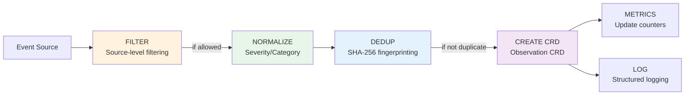

# Source-Level Filtering

Zen Watcher supports **per-source filtering** to reduce noise, cost, and keep Observations meaningful. Filtering happens **before** normalization, deduplication, and CRD creation.

## Overview

**Architectural Principle:**
> Filtering MUST happen before CRD creation, not after.

**Flow:**
```
informer|cm|webhook → filter() → normalize() → dedup() → create Observation CRD → update metrics & log
```

**Processing Pipeline:**



All components are centralized in `ObservationCreator.CreateObservation()` - no duplicated code.

See [ARCHITECTURE.md](ARCHITECTURE.md#2-event-processing-pipeline) for complete pipeline documentation.

## Configuration

### ConfigMap Setup

Create a ConfigMap named `zen-watcher-filter` (configurable) in the `zen-system` namespace (configurable):

```bash
kubectl create configmap zen-watcher-filter -n zen-system \
  --from-file=filter.json=filter.json
```

### Dynamic Reloading

**✨ Filter configuration reloads automatically without restart!**

Zen Watcher watches the ConfigMap for changes and reloads the filter configuration dynamically. This means you can update filters without restarting the pod:

```bash
# Update the ConfigMap
kubectl edit configmap zen-watcher-filter -n zen-system

# Or apply a new filter.json
kubectl create configmap zen-watcher-filter -n zen-system \
  --from-file=filter.json=filter.json \
  --dry-run=client -o yaml | kubectl apply -f -
```

**Features:**
- ✅ **No restart required** - Changes take effect within seconds
- ✅ **Last-good-config fallback** - Invalid configs don't break the filter
- ✅ **Thread-safe** - Updates happen atomically without blocking operations
- ✅ **Kubernetes-native** - Uses standard informer pattern

**Reload Behavior:**
- Valid config changes → Filter updates immediately
- Invalid JSON → Last known good config is preserved
- Missing key → Last known good config is preserved
- ConfigMap deleted → Last known good config is preserved (no reset to default)

### Ingester CRD (Kubernetes-Native)

**✨ New in v1.0+:** You can also use Kubernetes-native `Ingester` CRDs instead of (or in addition to) ConfigMap-based filters.

**Advantages:**
- ✅ **RBAC-granular** - Per-namespace or cluster-scoped permissions
- ✅ **Versioned** - GitOps-friendly, diffable
- ✅ **Kubernetes-native** - Standard CRD pattern
- ✅ **Multi-tenant** - Namespace-scoped filters for different teams

**Usage:**
```yaml
apiVersion: zen.kube-zen.io/v1alpha1
kind: Ingester
metadata:
  name: trivy-high-severity
  namespace: zen-system
spec:
  targetSource: trivy
  includeSeverity:
    - CRITICAL
    - HIGH
  excludeEventTypes:
    - info
```

**Merging Behavior:**
- ConfigMap filters are applied first
- Ingester CRDs are merged on top
- Multiple Ingesters targeting the same source are merged together
- Lists are unioned (exclude) or intersected (include)
- Most restrictive settings win (e.g., higher minSeverity)

**Watching Namespaces:**
- Default: Watches all namespaces (cluster-wide)
- Set `OBSERVATION_FILTER_NAMESPACE` env var to watch specific namespace only

See [Ingester CRD Reference](#observationfilter-crd-reference) for complete CRD specification.

### Environment Variables

| Variable | Description | Default |
|----------|-------------|---------|
| `FILTER_CONFIGMAP_NAME` | Filter ConfigMap name | `zen-watcher-filter` |
| `FILTER_CONFIGMAP_NAMESPACE` | Filter ConfigMap namespace | `zen-system` (or `WATCH_NAMESPACE`) |
| `FILTER_CONFIGMAP_KEY` | Filter ConfigMap data key | `filter.json` |
| `OBSERVATION_FILTER_NAMESPACE` | Namespace to watch for Ingester CRDs (empty = all namespaces) | `""` (all namespaces) |

### Filter Configuration Format

**ConfigMap Format:**

The ConfigMap should contain a JSON file with per-source filter rules:

```json
{
  "sources": {
    "trivy": {
      "includeSeverity": ["CRITICAL", "HIGH"]
    },
    "kyverno": {
      "excludeRules": ["disallow-latest-tag"],
      "excludeEventTypes": ["audit", "info"],
      "excludeKinds": ["ConfigMap", "Secret"]
    },
    "kubernetesEvents": {
      "ignoreKinds": ["Pod", "ConfigMap"]
    },
    "audit": {
      "includeEventTypes": ["resource-deletion", "secret-access", "rbac-change"]
    },
    "falco": {
      "includeNamespaces": ["production", "staging"]
    },
    "kube-bench": {
      "excludeCategories": ["compliance"]
    },
    "checkov": {
      "enabled": false
    }
  }
}
```

## Filter Options

### Per-Source Configuration

Each source can have the following filter options:

#### `minSeverity` (string)
Minimum severity level to allow. Severity levels: `CRITICAL` > `HIGH` > `MEDIUM` > `LOW` > `UNKNOWN`

**Example:**
```json
{
  "trivy": {
    "minSeverity": "MEDIUM"
  }
}
```
- Allows: CRITICAL, HIGH, MEDIUM
- Filters out: LOW, UNKNOWN

**Note:** If `includeSeverity` is set, it takes precedence over `minSeverity`.

#### `includeSeverity` (array of strings)
Explicit list of severity levels to include. Only observations with these severity levels are allowed.

**Example:**
```json
{
  "trivy": {
    "includeSeverity": ["CRITICAL", "HIGH"]
  }
}
```
- Allows: Only CRITICAL and HIGH
- Filters out: MEDIUM, LOW, UNKNOWN

**Note:** If `includeSeverity` is set, `minSeverity` is ignored for that source.

#### `excludeEventTypes` / `includeEventTypes` (array of strings)
Filter by event type.

**Example:**
```json
{
  "kyverno": {
    "excludeEventTypes": ["audit", "info"]
  },
  "audit": {
    "includeEventTypes": ["resource-deletion", "secret-access"]
  }
}
```

#### `excludeNamespaces` / `includeNamespaces` (array of strings)
Filter by namespace.

**Example:**
```json
{
  "trivy": {
    "excludeNamespaces": ["kube-system", "kube-public"]
  },
  "falco": {
    "includeNamespaces": ["production", "staging"]
  }
}
```

#### `excludeKinds` / `includeKinds` (array of strings)
Filter by resource kind.

**Example:**
```json
{
  "kyverno": {
    "excludeKinds": ["ConfigMap", "Secret"]
  }
}
```

#### `ignoreKinds` (array of strings)
Alias for `excludeKinds`. Convenience option for kubernetesEvents source. If both `ignoreKinds` and `excludeKinds` are set, they are merged.

**Example:**
```json
{
  "kubernetesEvents": {
    "ignoreKinds": ["Pod", "ConfigMap"]
  }
}
```

#### `excludeRules` (array of strings)
Filter by rule name. Used for sources like Kyverno where observations have a rule name in `details.rule`.

**Example:**
```json
{
  "kyverno": {
    "excludeRules": ["disallow-latest-tag"]
  }
}
```
- Filters out observations where `details.rule` matches any rule in the list

#### `excludeCategories` / `includeCategories` (array of strings)
Filter by category (security, compliance, etc.).

**Example:**
```json
{
  "kube-bench": {
    "excludeCategories": ["compliance"]
  }
}
```

#### `enabled` (boolean)
Enable or disable a source entirely.

**Example:**
```json
{
  "checkov": {
    "enabled": false
  }
}
```

## Examples

### Example 1: Filter Trivy - Include Only CRITICAL and HIGH

```json
{
  "sources": {
    "trivy": {
      "includeSeverity": ["CRITICAL", "HIGH"]
    }
  }
}
```

**Result:** Only CRITICAL and HIGH vulnerabilities create Observations.

### Example 1b: Filter Trivy LOW Severity (using minSeverity)

```json
{
  "sources": {
    "trivy": {
      "minSeverity": "MEDIUM"
    }
  }
}
```

**Result:** Only MEDIUM, HIGH, and CRITICAL vulnerabilities create Observations.

### Example 2: Kyverno - Exclude Specific Rules

```json
{
  "sources": {
    "kyverno": {
      "excludeRules": ["disallow-latest-tag"]
    }
  }
}
```

**Result:** All Kyverno policy violations are allowed except for the "disallow-latest-tag" rule.

### Example 2b: Kyverno - Exclude Audit Policies

```json
{
  "sources": {
    "kyverno": {
      "excludeEventTypes": ["audit"],
      "excludeKinds": ["ConfigMap", "Secret"]
    }
  }
}
```

**Result:** Only security policy violations on Pods, Deployments, etc. create Observations.

### Example 3: Audit - Only Important Events

```json
{
  "sources": {
    "audit": {
      "includeEventTypes": ["resource-deletion", "secret-access", "rbac-change", "privileged-pod-creation"]
    }
  }
}
```

**Result:** Only critical audit events create Observations.

### Example 4: Production-Only Falco

```json
{
  "sources": {
    "falco": {
      "includeNamespaces": ["production", "staging"]
    }
  }
}
```

**Result:** Only Falco alerts from production and staging namespaces create Observations.

### Example 5: Kubernetes Events - Ignore Specific Kinds

```json
{
  "sources": {
    "kubernetesEvents": {
      "ignoreKinds": ["Pod", "ConfigMap"]
    }
  }
}
```

**Result:** Kubernetes events for Pods and ConfigMaps are filtered out.

### Example 6: Disable Checkov

```json
{
  "sources": {
    "checkov": {
      "enabled": false
    }
  }
}
```

**Result:** No Checkov observations are created.

### Example 7: Complete Filter Configuration (v0.1.0 Requirements)

```json
{
  "sources": {
    "trivy": {
      "includeSeverity": ["CRITICAL", "HIGH"]
    },
    "kyverno": {
      "excludeRules": ["disallow-latest-tag"]
    },
    "kubernetesEvents": {
      "ignoreKinds": ["Pod", "ConfigMap"]
    }
  }
}
```

**Result:** 
- Trivy: Only CRITICAL and HIGH vulnerabilities
- Kyverno: All rules except "disallow-latest-tag"
- Kubernetes Events: All kinds except Pod and ConfigMap

## Behavior

### Default Behavior (No ConfigMap)

If the ConfigMap is not found, zen-watcher defaults to **"allow all"** (no filtering). This ensures:
- Backward compatibility
- No breaking changes
- Easy adoption

### Filtering Order

Filters are applied in this order:
1. **Source enabled check** - If disabled, filter out immediately
2. **IncludeSeverity** - Check if severity is in include list (takes precedence over MinSeverity)
3. **MinSeverity** - Check severity level (only if IncludeSeverity is not set)
4. **EventType filters** - Exclude/include by event type
5. **Namespace filters** - Exclude/include by namespace
6. **Kind filters** - Exclude/include by resource kind (includes IgnoreKinds)
7. **Category filters** - Exclude/include by category
8. **Rule filters** - Exclude by rule name (for sources like Kyverno)

If any filter rejects the observation, it is filtered out (no CRD creation, no metrics, no logs).

### Logging

When an observation is filtered out, zen-watcher logs:
```
🚫 [FILTER] Source 'trivy': severity 'LOW' below minimum 'MEDIUM'
```

## Benefits

### Performance
- **Saves CPU** - Filtered events never create CRDs
- **Saves memory** - No CRD objects in memory
- **Reduces disk churn** - Fewer etcd writes
- **Reduces CRD count** - Only meaningful observations

### Cost
- **Reduces agent noise** - Fewer events to process downstream
- **Reduces external system costs** - Fewer events sent to external systems
- **Keeps Observations meaningful** - No low-value noise

### Use Cases

1. **Trivy LOW severity** - Ignore informational vulnerabilities
2. **Kyverno audit policies** - Only security policy violations
3. **Kubernetes events** - Only specific kinds/namespaces
4. **Production-only** - Filter by namespace
5. **Disable sources** - Turn off specific tools

## Implementation Details

### Code Location

- **Filter Config Loading**: `pkg/filter/config.go`
- **Filter Rules**: `pkg/filter/rules.go` (thread-safe with dynamic updates)
- **ConfigMap Watcher**: `pkg/config/configmap_loader.go` (dynamic reloading)
- **Filter Integration**: `pkg/watcher/observation_creator.go`

### Filter Interface

```go
type Filter struct {
    config *FilterConfig
}

func (f *Filter) Allow(observation *unstructured.Unstructured) bool
```

### Integration Point

Filtering is integrated in `ObservationCreator.CreateObservation()`:

```go
func (oc *ObservationCreator) CreateObservation(ctx context.Context, observation *unstructured.Unstructured) error {
    // STEP 1: FILTER - Apply source-level filtering
    if oc.filter != nil && !oc.filter.Allow(observation) {
        return nil // Filtered out - no processing
    }
    
    // STEP 2: NORMALIZE - Severity normalization
    // STEP 3: DEDUP - Deduplication
    // STEP 4: CREATE - CRD creation
    // STEP 5: METRICS - Update metrics
    // STEP 6: LOG - Structured logging
}
```

## Testing

Unit tests are available in `pkg/filter/rules_test.go`:

```bash
go test ./pkg/filter/... -v
```

Tests cover:
- MinSeverity filtering
- EventType filtering (exclude/include)
- Namespace filtering (exclude/include)
- Kind filtering (exclude/include)
- Category filtering (exclude/include)
- Source enable/disable

## Troubleshooting

### Filter Not Working

1. **Check ConfigMap exists:**
   ```bash
   kubectl get configmap zen-watcher-filter -n zen-system
   ```

2. **Check ConfigMap content:**
   ```bash
   kubectl get configmap zen-watcher-filter -n zen-system -o yaml
   ```

3. **Check logs for filter messages:**
   ```bash
   kubectl logs -n zen-system deployment/zen-watcher | grep FILTER
   ```

4. **Verify filter is loaded:**
   ```bash
   kubectl logs -n zen-system deployment/zen-watcher | grep "Loaded filter configuration"
   ```

5. **Check for dynamic reload:**
   ```bash
   kubectl logs -n zen-system deployment/zen-watcher | grep "Reloaded filter configuration"
   ```

6. **Verify ConfigMap watcher is running:**
   ```bash
   kubectl logs -n zen-system deployment/zen-watcher | grep "ConfigMap watcher started"
   ```

### Filter Too Restrictive

If too many events are filtered out:
1. Check filter rules are correct
2. Verify severity levels match your expectations
3. Check namespace/kind filters aren't too restrictive
4. Review logs to see what's being filtered

### Filter Not Restrictive Enough

If unwanted events are still creating Observations:
1. Add more restrictive filters
2. Use `includeEventTypes` instead of `excludeEventTypes`
3. Use `includeNamespaces` instead of `excludeNamespaces`
4. Lower `minSeverity` threshold

## Best Practices

1. **Start permissive, then restrict** - Begin with minimal filters, add restrictions as needed
2. **Use minSeverity for scanners** - Filter out LOW severity from Trivy, Checkov, etc.
3. **Filter by namespace** - Focus on production namespaces
4. **Exclude system namespaces** - Filter out kube-system, kube-public, etc.
5. **Use include lists for critical sources** - For audit, only include important event types
6. **Test filters incrementally** - Add one filter at a time and verify behavior

---

## Filter Language Reference (Expression-Based Filters)

zen-watcher supports a powerful expression-based filter language (v1.1) for fine-grained control over which Observations are processed.

### Overview

Filter expressions allow you to combine multiple conditions using logical operators (AND, OR, NOT) and comparison operators. Expressions are evaluated against Observation data and must return a boolean result.

### Syntax

#### Basic Structure

```yaml
filters:
  expression: |
    (condition1) AND (condition2) OR (condition3)
```

#### Field Access

Fields are accessed using dot notation:

- `spec.severity` - Severity level
- `spec.category` - Category
- `spec.source` - Source name
- `spec.eventType` - Event type
- `spec.details.vulnerabilityID` - Nested field access

### Operators

#### Comparison Operators

| Operator | Description | Example |
|----------|-------------|---------|
| `=` | Equality | `spec.severity = "HIGH"` |
| `!=` | Inequality | `spec.category != "ops"` |
| `>` | Greater than | `spec.priority > 0.7` |
| `>=` | Greater than or equal | `spec.severity >= "HIGH"` |
| `<` | Less than | `spec.priority < 0.5` |
| `<=` | Less than or equal | `spec.severity <= "MEDIUM"` |
| `IN` | List membership | `spec.category IN ["security", "compliance"]` |
| `NOT IN` | Not in list | `spec.namespace NOT IN ["kube-system", "default"]` |
| `CONTAINS` | String contains | `spec.message CONTAINS "error"` |
| `STARTS_WITH` | String prefix | `spec.source STARTS_WITH "trivy"` |
| `ENDS_WITH` | String suffix | `spec.eventType ENDS_WITH "_violation"` |
| `EXISTS` | Field exists | `spec.details.vulnerabilityID EXISTS` |
| `NOT EXISTS` | Field missing | `spec.details.vulnerabilityID NOT EXISTS` |

#### Logical Operators

| Operator | Description | Precedence |
|----------|-------------|------------|
| `NOT` | Logical negation | Highest |
| `AND` | Logical AND | Medium |
| `OR` | Logical OR | Lowest |

**Precedence**: NOT > AND > OR

Use parentheses to override precedence:

```yaml
filters:
  expression: |
    (spec.severity >= "HIGH") AND (spec.category IN ["security", "compliance"])
```

### Macros

Predefined macros provide convenient shortcuts for common patterns:

| Macro | Equivalent To | Description |
|-------|---------------|-------------|
| `is_critical` | `spec.severity = "CRITICAL"` | Critical severity |
| `is_high` | `spec.severity = "HIGH"` | High severity |
| `is_security` | `spec.category = "security"` | Security category |
| `is_compliance` | `spec.category = "compliance"` | Compliance category |

**Example**:

```yaml
filters:
  expression: |
    is_critical OR (is_high AND is_security)
```

### Severity Comparison

Severity levels are ordered: `CRITICAL > HIGH > MEDIUM > LOW > UNKNOWN`

Comparisons like `>=` and `<=` respect this ordering:

```yaml
filters:
  expression: |
    spec.severity >= "HIGH"  # Matches HIGH, CRITICAL
```

### Expression Examples

#### High Severity Security Events

```yaml
filters:
  expression: |
    (spec.severity >= "HIGH") AND (spec.category = "security")
```

#### Exclude Specific Namespaces

```yaml
filters:
  expression: |
    spec.namespace NOT IN ["kube-system", "default", "kube-public"]
```

#### Complex Logic

```yaml
filters:
  expression: |
    (is_critical OR (is_high AND is_security)) AND
    spec.namespace NOT IN ["kube-system"]
```

#### Field Existence Check

```yaml
filters:
  expression: |
    spec.details.vulnerabilityID EXISTS AND
    spec.severity >= "HIGH"
```

#### String Matching

```yaml
filters:
  expression: |
    spec.message CONTAINS "CVE" OR
    spec.source STARTS_WITH "trivy"
```

### Backwards Compatibility

Filter expressions are **additive** and **backwards compatible**:

- If `expression` is **not set**, list-based filters are used (`minSeverity`, `includeNamespaces`, etc.)
- If `expression` **is set**, it takes precedence and list-based fields are ignored
- You can migrate gradually: start with list-based filters, then add expressions where needed

### Expression-Based Filters (v1.1)

```yaml
filters:
  expression: |
    spec.severity >= "HIGH" AND
    spec.namespace IN ["production", "staging"] AND
    spec.eventType NOT IN ["info", "debug"]
```

### Error Handling

Invalid expressions result in:

1. **Parse errors**: Syntax errors are logged and list-based filters are used as fallback
2. **Evaluation errors**: Runtime errors (e.g., type mismatches) are logged and list-based filters are used as fallback

**Best Practice**: Test expressions in a development environment before deploying to production.

### Performance Considerations

- Expressions are evaluated for each Observation
- Complex expressions with many nested conditions may impact throughput
- Use field existence checks (`EXISTS`) before accessing nested fields to avoid errors

---

## Related Documentation

- [Architecture](ARCHITECTURE.md) - Event processing pipeline
- [Developer Guide](DEVELOPER_GUIDE.md) - Adding new watchers
- [Contributing](./CONTRIBUTING.md) - Contribution guidelines

