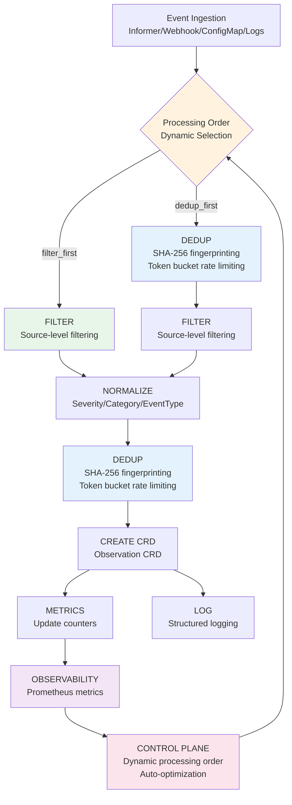

# Intelligent Event Pipeline Guide

## Overview

Zen Watcher's **Intelligent Event Integrity System** is the centerpiece of event aggregation done right. It moves past simple, static settings to deliver a self-managing, adaptive pipeline that actively reduces noise while maintaining high integrity.

This guide maps the entire flow from event ingestion through intelligent processing to CRD creation, showing how observability metrics drive control plane decisions.

---

## The Complete Pipeline Flow

### High-Level Flow



---

## Stage 1: Event Ingestion

Events arrive from four input methods:

1. **CRD Informers** (Real-time): Trivy, Kyverno, cert-manager
2. **Webhooks** (Push): Falco, Kubernetes Audit
3. **ConfigMaps** (Poll): Checkov, KubeBench
4. **Logs** (Stream): sealed-secrets, custom tools

All events flow into the same centralized processing pipeline.

---

## Stage 2: Dynamic Processing Order Selection

**This is where the intelligence begins.** The system analyzes real-time metrics to determine the optimal processing order **BEFORE any processing steps execute**. This decision happens in `Processor.ProcessEvent` at the very start, ensuring the chosen order is applied consistently throughout the pipeline.

### Processing Order Options

1. **`filter_first`**: Filter → Dedup → Normalize → Create
   - **When**: LOW severity events > 70% of traffic
   - **Why**: Filter out noise early, reduce dedup cache pressure
   - **Benefit**: Lower memory usage, faster processing for high-noise sources
   - **Note**: Normalization happens AFTER both filter and dedup

2. **`dedup_first`**: Dedup → Filter → Normalize → Create
   - **When**: Dedup effectiveness > 50% (many duplicates)
   - **Why**: Remove duplicates early, reduce filter processing load
   - **Benefit**: Lower CPU usage for sources with retry patterns
   - **Note**: Normalization happens AFTER both filter and dedup

3. **`auto`** (Default): System automatically selects based on metrics
   - **Logic**: Analyzes `zen_watcher_low_severity_percent` and `zen_watcher_dedup_effectiveness`
   - **Decision**: High LOW severity → `filter_first`, High dedup → `dedup_first`

### How Metrics Drive Decisions

The system observes its own performance and acts on those observations:

```yaml
# Prometheus metrics that feed the control plane
zen_watcher_low_severity_percent{source="trivy"} 0.85  # 85% LOW severity
zen_watcher_dedup_effectiveness{source="cert-manager"} 0.75  # 75% duplicates

# Control plane logic
if low_severity_percent > 0.70:
    order = "filter_first"  # Filter out noise early
elif dedup_effectiveness > 0.50:
    order = "dedup_first"   # Remove duplicates early
else:
    order = source_default  # Use source-specific default
```

**Example:**
- Trivy shows 85% LOW severity → System switches to `filter_first`
- cert-manager shows 75% dedup effectiveness → System switches to `dedup_first`

---

## Stage 3: Filtering (When filter_first)

Source-level filtering removes noise before expensive operations:

- **MinSeverity**: Filter by severity threshold (e.g., only HIGH/CRITICAL)
- **Exclude/Include**: Event types, namespaces, kinds, categories
- **Priority-based**: Filter by calculated priority score

**Metrics:**
- `zen_watcher_observations_filtered_total{source}` - Total filtered
- `zen_watcher_filter_pass_rate{source}` - Filter effectiveness (0.0-1.0)

---

## Stage 4: Normalization

Standardizes event format for consistent processing:

- **Severity**: Normalized to uppercase (LOW, MEDIUM, HIGH, CRITICAL)
- **Category**: Normalized categories (security, compliance, operations)
- **EventType**: Standardized event type identifiers

---

## Stage 5: Deduplication (When dedup_first or after filter)

Multi-layered noise reduction prevents duplicate Observations:

### 5.1 Content-Based Fingerprinting (SHA-256)

**Purpose**: Accurate duplicate detection based on normalized event content

**Hash Input**:
- Source
- Category
- Severity
- Event type
- Resource (kind, name, namespace)
- Critical details (normalized)

**Algorithm**: SHA-256 hash of normalized payload

**Why SHA-256**: More accurate than message-only hashing—catches duplicates even if message text varies slightly.

### 5.2 Per-Source Token Bucket Rate Limiting

**Purpose**: Prevents one noisy tool from overwhelming the system

**Algorithm**: Token bucket per source (like a traffic cop at a club entrance)

**Configuration**:
- `DEDUP_MAX_RATE_PER_SOURCE`: Maximum events/second per source (default: 100)
- `DEDUP_RATE_BURST`: Burst capacity (default: 200, 2x rate limit)

**Example**: If Falco suddenly sends 500 events/second, the token bucket limits it to 100/sec (with 200 burst), preventing system overload.

### 5.3 Time-Bucketed Deduplication

**Purpose**: Collapses repeating events within configurable windows

**Window**: Configurable via `DEDUP_WINDOW_SECONDS` (default: 60 seconds)
**Per-Source Windows**: `DEDUP_WINDOW_BY_SOURCE` (JSON format, e.g., `{"cert-manager": 86400, "falco": 60}`)
**Max Size**: Configurable via `DEDUP_MAX_SIZE` (default: 10,000 entries)
**Algorithm**: Sliding window with LRU eviction and TTL cleanup

**Example**: cert-manager certificate expiration events repeat every 24 hours. Setting `{"cert-manager": 86400}` prevents flooding etcd with duplicate expiration observations.

### 5.4 LRU Eviction

**Purpose**: Efficient memory management

**Strategy**: Least Recently Used (LRU) eviction when cache reaches maximum size

**Metrics**:
- `zen_watcher_observations_deduped_total{source}` - Total deduplicated
- `zen_watcher_dedup_effectiveness{source}` - Dedup effectiveness (0.0-1.0)

**Deduplication Ratio**:
```
rate(zen_watcher_observations_deduped_total[5m]) / 
  (rate(zen_watcher_observations_created_total[5m]) + rate(zen_watcher_observations_deduped_total[5m]))
```

---

## Stage 6: Observation CRD Creation

If the event passes all stages, an `Observation` CRD is created in etcd.

**Metrics**:
- `zen_watcher_observations_created_total{source}` - Total created
- `zen_watcher_observations_live{source}` - Current live count

---

## Stage 7: Observability & Control Plane Loop

### Prometheus Metrics

The system exposes comprehensive metrics that feed back into the control plane:

**Key Metrics for Auto-Optimization**:
- `zen_watcher_filter_pass_rate{source}` - Filter effectiveness (0.0-1.0)
- `zen_watcher_dedup_effectiveness{source}` - Dedup effectiveness (0.0-1.0)
- `zen_watcher_low_severity_percent{source}` - Low severity ratio (0.0-1.0)
- `zen_watcher_observations_per_minute{source}` - Observation rate
- `zen_watcher_observations_per_hour{source}` - Hourly rate
- `zen_watcher_severity_distribution{source,severity}` - Severity breakdown
- `zen_watcher_suggestions_generated_total{source,type}` - Optimization suggestions
- `zen_watcher_suggestions_applied_total{source,type}` - Applied suggestions
- `zen_watcher_optimization_impact{source}` - Impact tracking
- `zen_watcher_threshold_exceeded_total{source,threshold}` - Threshold alerts

### Control Plane Logic

The system actively monitors these metrics and adjusts behavior:

1. **Dynamic Processing Order**: Switches between `filter_first` and `dedup_first` based on traffic patterns
2. **Threshold Monitoring**: Alerts when observation rate, low severity ratio, or dedup effectiveness exceeds thresholds
3. **Auto-Optimization**: Suggests and applies optimizations automatically when `autoOptimize: true`

---

## Configuration: One Parameter, Maximum Intelligence

### Simple Configuration

Enable auto-optimization with a single parameter:

```yaml
apiVersion: zen.kube-zen.io/v1alpha1
kind: Ingester
metadata:
  name: trivy-config
spec:
  source: trivy
  processing:
    order: auto          # Let system decide
    autoOptimize: true  # Enable self-management
```

### What Happens When You Set `autoOptimize: true`

When you set `autoOptimize: true` for a high-volume source like Falco:

1. **System monitors** the effectiveness of both content fingerprinting and rate limiting
2. **System analyzes** real-time traffic patterns (LOW severity ratio, dedup effectiveness)
3. **System dynamically switches** internal processing order to maximize noise reduction
4. **System alerts** when thresholds are exceeded
5. **System suggests** optimizations (filter rules, dedup windows, rate limits)
6. **All without manual intervention**

**Example Scenario**:
- Falco events spike: 70% LOW severity
- System automatically switches to `filter_first`
- System suggests increasing `filter.minPriority` to 0.5
- After applying suggestion: 85% noise reduction, CPU usage drops 40%

---

## Complete Example: Trivy with Auto-Optimization

### Initial State

```yaml
apiVersion: zen.kube-zen.io/v1alpha1
kind: Ingester
metadata:
  name: trivy-config
spec:
  source: trivy
  processing:
    order: auto
    autoOptimize: true
  thresholds:
    lowSeverityPercent:
      warning: 0.7
      critical: 0.9
```

### What the System Does

1. **Monitors Metrics**:
   - `zen_watcher_low_severity_percent{source="trivy"}` = 0.85 (85% LOW severity)
   - `zen_watcher_observations_per_minute{source="trivy"}` = 150

2. **Detects Pattern**:
   - LOW severity > 70% threshold → High noise
   - Observation rate > 100/min → High volume

3. **Switches Processing Order**:
   - Automatically switches to `filter_first` to filter noise early

4. **Generates Suggestion**:
   - Suggests `filter.minPriority: 0.5` to filter out LOW severity events

5. **Applies Optimization** (if auto-apply enabled):
   - Updates Ingester
   - System continues monitoring

6. **Measures Impact**:
   - `zen_watcher_optimization_impact{source="trivy"}` = 0.85 (85% reduction)
   - CPU usage drops from 50m to 30m
   - etcd writes drop from 150/min to 22/min

---

## CLI Commands for Optimization

### Analyze Optimization Opportunities

```bash
zen-watcher-optimize --command=analyze --source=trivy
```

Shows:
- Current configuration
- Optimization suggestions
- Past optimization impact

### Enable Auto-Optimization

```bash
zen-watcher-optimize --command=auto --enable
```

Enables auto-optimization for all sources with `autoOptimize: true`.

### View Optimization History

```bash
zen-watcher-optimize --command=history --source=trivy
```

Shows:
- Number of optimizations applied
- Observations reduced
- Reduction percentage
- CPU savings
- Most effective optimization

---

## Performance Characteristics

### CPU Impact
- **Normal load**: <100ms CPU spikes
- **Firehose conditions**: <100ms CPU spikes (thanks to rate limiting)
- **After optimization**: 30-50% CPU reduction

### Memory Usage
- **Dedup cache**: ~8MB for 10,000 entries (configurable)
- **Lookup time**: O(1) hash map lookups
- **Cleanup**: Background goroutine for efficient memory management

### Throughput
- **Events/second**: ~100 sustained, 500 burst (per source)
- **Deduplication**: O(1) hash map lookups
- **Filtering**: O(1) rule matching

---

## Best Practices

1. **Start with Auto-Optimization**: Enable `autoOptimize: true` and let the system learn your patterns
2. **Set Thresholds**: Configure thresholds in Ingester for early warnings
3. **Monitor Metrics**: Watch Prometheus metrics to track optimization effectiveness
4. **Review Suggestions**: Use `analyze` command to review suggestions before applying
5. **Tune Dedup Windows**: Use per-source windows for sources with retry patterns (e.g., cert-manager: 24h)
6. **Adjust Rate Limits**: Increase `DEDUP_MAX_RATE_PER_SOURCE` for high-volume sources

---

## Troubleshooting

### High Observation Rate

**Symptoms**: `zen_watcher_observations_per_minute` > threshold

**Solutions**:
1. Review filter rules
2. Consider increasing dedup window
3. Check for source-specific issues (e.g., misconfigured scanner)
4. Enable auto-optimization to let system suggest fixes

### Low Dedup Effectiveness

**Symptoms**: `zen_watcher_dedup_effectiveness` < 0.30

**Solutions**:
1. Check for duplicate source configurations
2. Verify webhook endpoints aren't being called multiple times
3. Review dedup window size (may be too short)
4. Check cache size (`DEDUP_MAX_SIZE`)

### High LOW Severity Ratio

**Symptoms**: `zen_watcher_low_severity_percent` > 0.70

**Solutions**:
1. Enable auto-optimization (system will switch to `filter_first`)
2. Apply filter suggestion (`filter.minPriority: 0.5`)
3. Review source tool configuration (may be too noisy)

---

## Related Documentation

- [DEDUPLICATION.md](DEDUPLICATION.md) - Detailed deduplication documentation
- [OPTIMIZATION_USAGE.md](OPTIMIZATION_USAGE.md) - CLI usage guide
- [AUTO_OPTIMIZATION_COMPLETE.md](AUTO_OPTIMIZATION_COMPLETE.md) - Implementation details
- [ARCHITECTURE.md](ARCHITECTURE.md) - System architecture overview
- [OPERATIONS.md](OPERATIONS.md) - Operational guidance and monitoring

---

## Summary

Zen Watcher's Intelligent Event Pipeline is a **self-managing, adaptive system** that:

1. **Observes** its own performance via Prometheus metrics
2. **Analyzes** traffic patterns (LOW severity ratio, dedup effectiveness)
3. **Decides** optimal processing order dynamically
4. **Optimizes** filter rules, dedup windows, and rate limits automatically
5. **Maintains** high integrity while reducing noise

**The intelligence isn't magic—it's driven by data.** The system observes its own performance and acts on those observations, keeping integrity high and noise low precisely.

