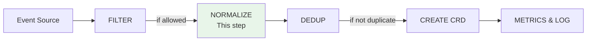

# Event Normalization

Zen Watcher normalizes events from different sources into a standard format before creating Observation CRDs. Normalization ensures consistent data structure, accurate deduplication, and enables cross-tool comparison.

## Overview

Normalization converts tool-specific event formats into the standard `Event` model, which is then used to create Observation CRDs. This happens after filtering and before deduplication in the processing pipeline.

**Processing Flow:**
```
informer|cm|webhook → filter() → normalize() → dedup() → create Observation CRD → update metrics & log
```

**Pipeline Diagram:**



Normalization happens after filtering and before deduplication. See [ARCHITECTURE.md](ARCHITECTURE.md#2-event-processing-pipeline) for the complete pipeline.

## Normalized Event Model

All events are normalized to the standard `Event` struct:

```go
type Event struct {
    Source    string                      // Tool name (required)
    Category  string                      // security, compliance, performance (required)
    Severity  string                      // CRITICAL, HIGH, MEDIUM, LOW (required)
    EventType string                      // vulnerability, runtime-threat, etc. (required)
    Resource  *ResourceRef                // Affected K8s resource (optional)
    Details   map[string]interface{}      // Tool-specific data (optional)
    Namespace string                      // Target namespace (optional)
    DetectedAt string                     // RFC3339 timestamp (optional)
}
```

## Normalization Rules

### 1. Severity Normalization

All severity values are normalized to uppercase standard levels:

**Standard Levels:**
- `CRITICAL` - Critical issues requiring immediate attention
- `HIGH` - High priority issues
- `MEDIUM` - Medium priority issues
- `LOW` - Low priority issues
- `UNKNOWN` - Unknown or unclassified severity

**Tool-Specific Mappings:**

| Tool | Input Values | Normalized Output |
|------|-------------|-------------------|
| **Trivy** | `CRITICAL`, `HIGH`, `MEDIUM`, `LOW` | `CRITICAL`, `HIGH`, `MEDIUM`, `LOW` |
| **Falco** | `Emergency`, `Critical`, `Alert`, `Error`, `Warning`, `Notice`, `Informational` | `CRITICAL`, `CRITICAL`, `HIGH`, `HIGH`, `MEDIUM`, `LOW`, `LOW` |
| **Kyverno** | `fail`, `warn`, `error` | `HIGH`, `MEDIUM`, `HIGH` |
| **Audit** | `Request`, `Response` (mapped by event type) | `HIGH` (for security events), `MEDIUM` (for compliance) |
| **Generic** | `critical`, `fatal`, `emergency` → `CRITICAL`<br>`high`, `error`, `alert` → `HIGH`<br>`medium`, `warning`, `warn` → `MEDIUM`<br>`low`, `info`, `informational` → `LOW` | Standard levels |

**Implementation:**
```go
func normalizeSeverity(severity string) string {
    upper := strings.ToUpper(severity)
    switch upper {
    case "CRITICAL", "FATAL", "EMERGENCY":
        return "CRITICAL"
    case "HIGH", "ERROR", "ALERT":
        return "HIGH"
    case "MEDIUM", "WARNING", "WARN":
        return "MEDIUM"
    case "LOW", "INFO", "INFORMATIONAL":
        return "LOW"
    default:
        return "UNKNOWN"
    }
}
```

### 2. Category Assignment

Events are categorized based on their nature:

**Standard Categories:**
- `security` - Security-related events (vulnerabilities, threats, policy violations)
- `compliance` - Compliance-related events (audit logs, CIS benchmarks)
- `performance` - Performance-related events (resource usage, latency)
- Custom categories are supported but not recommended

**Tool-Specific Category Mapping:**

| Tool | Category | Rationale |
|------|----------|----------|
| **Trivy** | `security` | Vulnerability scanning |
| **Falco** | `security` | Runtime threat detection |
| **Kyverno** | `security` | Policy violations (security policies) |
| **Audit** | `compliance` | Kubernetes audit logs |
| **Kube-bench** | `compliance` | CIS benchmark compliance |
| **Checkov** | `security` | Infrastructure-as-code security |

### 3. Event Type Assignment

Event types describe the specific nature of the event:

**Common Event Types:**

**Security:**
- `vulnerability` - Container or image vulnerabilities
- `runtime-threat` - Runtime security threats
- `policy-violation` - Security policy violations
- `static-analysis` - Static code analysis findings

**Compliance:**
- `audit-event` - Kubernetes audit log events
- `cis-benchmark-fail` - CIS benchmark failures
- `resource-deletion` - Resource deletion events
- `secret-access` - Secret access events
- `rbac-change` - RBAC configuration changes

**Tool-Specific Event Types:**

| Tool | Event Types |
|------|-------------|
| **Trivy** | `vulnerability`, `trivy_update_detected` |
| **Falco** | `runtime-threat`, `falco_security_event` |
| **Kyverno** | `policy-violation`, `policy_created`, `policy_updated`, `violation_detected` |
| **Audit** | `audit-event`, `audit_security_event`, `resource-deletion`, `secret-access`, `rbac-change`, `privileged-pod-creation` |
| **Kube-bench** | `cis-benchmark-fail` |
| **Checkov** | `static-analysis` |

### 4. Resource Normalization

Kubernetes resource references are normalized to a standard format:

```go
type ResourceRef struct {
    APIVersion string  // e.g., "v1", "apps/v1"
    Kind       string  // e.g., "Pod", "Deployment"
    Name       string  // Resource name
    Namespace  string  // Namespace (preserved for RBAC/auditing)
}
```

**Normalization Rules:**
- Resource kind is capitalized (e.g., `pod` → `Pod`)
- Namespace is preserved (not stripped) for RBAC and auditing
- Missing fields are left empty (not filled with defaults)

### 5. Timestamp Normalization

Timestamps are normalized to RFC3339 format:

- Input: Any timestamp format from source tools
- Output: RFC3339 format (e.g., `2025-01-15T10:30:00Z`)
- Field: `spec.detectedAt` in Observation CRD

## Normalization in Processing Pipeline

### Step 1: Source-Specific Extraction

Each adapter extracts data from its source format:

```go
// Example: Trivy adapter
event := Event{
    Source:    "trivy",
    Category:  "security",
    Severity:  normalizeSeverity(vuln["severity"]),  // Normalized here
    EventType: "vulnerability",
    Resource:  extractResource(vuln),
    Details:  vuln,  // Tool-specific data preserved
}
```

### Step 2: Centralized Normalization

The `ObservationCreator` performs final normalization:

```go
// In ObservationCreator.CreateObservation()
// Severity is normalized to uppercase
if severity != "" {
    severity = normalizeSeverity(severity)
}
```

### Step 3: Deduplication Uses Normalized Content

Deduplication uses SHA-256 hash of normalized content:

- Normalized severity, category, eventType
- Normalized resource (kind, name, namespace)
- Critical details (normalized)

This ensures accurate duplicate detection across different tool formats.

## Benefits of Normalization

1. **Consistent Data Structure**: All Observations follow the same schema regardless of source
2. **Accurate Deduplication**: SHA-256 fingerprinting uses normalized content
3. **Cross-Tool Comparison**: Events from different tools can be compared using standard fields
4. **Simplified Querying**: Standard severity levels and categories enable consistent filtering
5. **RBAC Support**: Normalized namespace field enables granular access control

## Custom Adapters

When creating custom adapters, follow normalization rules:

1. **Map Severity**: Use `normalizeSeverity()` function or equivalent logic
2. **Assign Category**: Choose appropriate category (`security`, `compliance`, `performance`)
3. **Set EventType**: Use descriptive event type or create custom one
4. **Normalize Resource**: Extract and normalize Kubernetes resource references
5. **Preserve Details**: Keep tool-specific data in `details` field

See [SOURCE_ADAPTERS.md](SOURCE_ADAPTERS.md) for complete adapter development guide.

## Configuration

Normalization is automatic and not configurable. All events are normalized using the same rules to ensure consistency.

## See Also

- [SOURCE_ADAPTERS.md](SOURCE_ADAPTERS.md) - How to create adapters with proper normalization
- [DEDUPLICATION.md](DEDUPLICATION.md) - How normalized content is used for deduplication
- [ARCHITECTURE.md](ARCHITECTURE.md) - Overall system architecture
- [CRD.md](CRD.md) - Observation CRD schema

