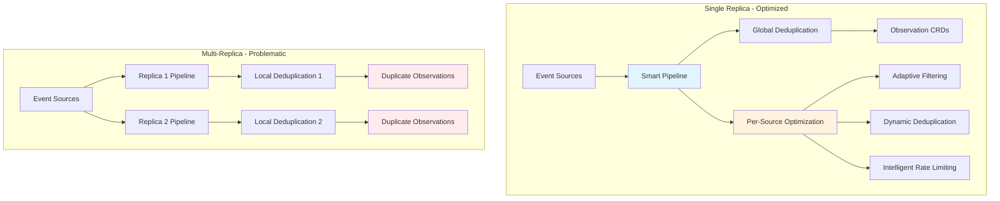
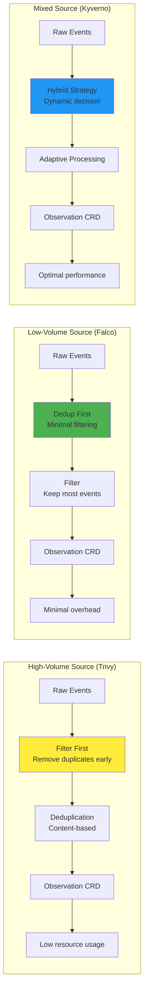
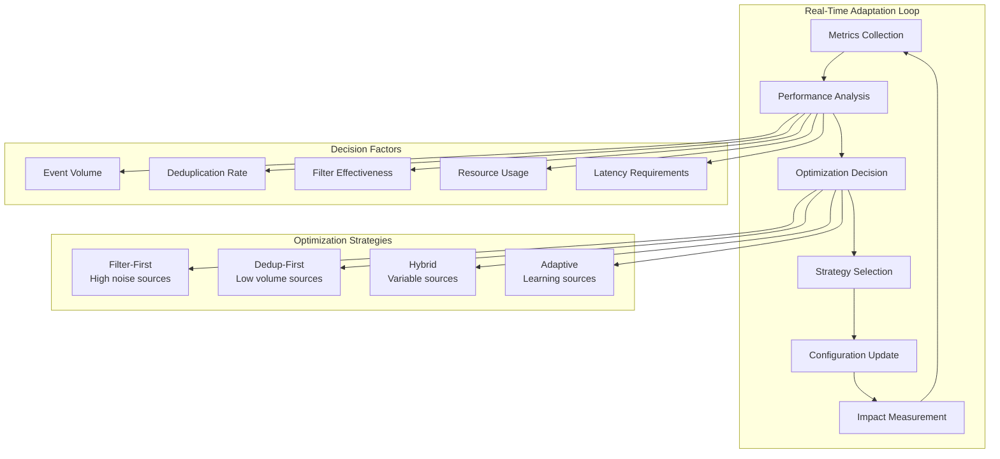

---
⚠️ HISTORICAL DOCUMENT - EXPERT PACKAGE ARCHIVE ⚠️

This document is from an external "Expert Package" analysis of zen-watcher/ingester.
It reflects the state of zen-watcher at a specific point in time and may be partially obsolete.

CANONICAL SOURCES (use these for current direction):
- docs/PM_AI_ROADMAP.md - Current roadmap and priorities
- CONTRIBUTING.md - Current quality bar and standards
- docs/INFORMERS_CONVERGENCE_NOTES.md - Current informer architecture
- docs/STRESS_TEST_RESULTS.md - Current performance baselines

This archive document is provided for historical context, rationale, and inspiration only.
Do NOT use this as a replacement for current documentation.

---

# Zen Watcher Per-Source Auto-Optimization Implementation Guide

## Overview

This guide provides comprehensive implementation instructions for Zen Watcher's per-source auto-optimization feature. The enhancement enables intelligent, autonomous optimization of event processing pipelines for each observation source, delivering significant performance improvements and resource savings.

## Table of Contents

1. [Technical Implementation Steps](#technical-implementation-steps)
2. [Architecture Changes](#architecture-changes)
3. [Key Benefits & Diagrams](#key-benefits--diagrams)
4. [Implementation Phases](#implementation-phases)
5. [Code Examples](#code-examples)
6. [Testing & Validation](#testing--validation)
7. [Monitoring & Observability](#monitoring--observability)

---

## Technical Implementation Steps

### 1. Enhanced Configuration Structure

#### 1.1 Extend SourceConfig for Per-Source Optimization

**Current Structure:**
```go
type SourceConfig struct {
    Source      string
    DedupWindow time.Duration
    DedupStrategy string
    // ... existing fields
}
```

**Enhanced Structure:**
```go
type SourceConfig struct {
    Source      string
    DedupWindow time.Duration
    DedupStrategy string
    DedupFields []string
    
    // Enhanced Optimization Configuration
    Processing struct {
        Order         string            // auto, filter_first, dedup_first
        AutoOptimize  bool              // Enable auto-optimization
        Thresholds    map[string]*ThresholdConfig
        Metrics       map[string]*MetricConfig
    }
    
    // Advanced Filtering
    Filter struct {
        MinPriority   float64
        ExcludeNamespaces []string
        IncludeTypes   []string
        DynamicRules   []DynamicFilterRule
    }
    
    // Intelligent Deduplication
    Deduplication struct {
        Window         time.Duration
        Strategy       string         // fingerprint, content, hybrid
        Adaptive       bool           // Enable adaptive deduplication
        Fields         []string       // Fields to consider
        MinChange      float64        // Minimum change threshold
    }
    
    // Rate Limiting & Throttling
    RateLimit struct {
        MaxPerMinute   int
        Burst          int
        Adaptive       bool           // Enable adaptive rate limiting
        CooldownPeriod time.Duration
    }
}
```

#### 1.2 New Threshold Configuration

```go
type ThresholdConfig struct {
    Type        string      // observations_per_minute, dedup_effectiveness, etc.
    Warning     float64     // Warning threshold
    Critical    float64     // Critical threshold
    Window      time.Duration // Measurement window
    Action      string      // warn, alert, block
    Description string      // Human-readable description
}
```

#### 1.3 Dynamic Filter Rules

```go
type DynamicFilterRule struct {
    ID          string
    Priority    int         // Execution order
    Enabled     bool
    Condition   string      // JSONPath condition
    Action      string      // include, exclude, modify
    TTL         time.Duration // Rule expiration
    Metrics     map[string]float64
}
```

### 2. Adapter Interface Modifications

#### 2.1 Enhanced SourceAdapter Interface

**Current Interface:**
```go
type SourceAdapter interface {
    Initialize(config *SourceConfig) error
    Start(ctx context.Context) error
    Stop() error
    GetMetrics() map[string]interface{}
}
```

**Enhanced Interface:**
```go
type SourceAdapter interface {
    Initialize(config *SourceConfig) error
    Start(ctx context.Context) error
    Stop() error
    GetMetrics() map[string]interface{}
    
    // New optimization methods
    GetOptimizationMetrics() *OptimizationMetrics
    ApplyOptimization(config *SourceConfig) error
    ValidateOptimization() error
    ResetMetrics()
}
```

#### 2.2 Optimization Metrics Interface

```go
type OptimizationMetrics struct {
    Source string
    
    // Processing Metrics
    EventsProcessed    int64
    EventsFiltered     int64
    EventsDeduped      int64
    ProcessingLatency  time.Duration
    
    // Quality Metrics
    DeduplicationRate  float64
    FilterEffectiveness float64
    FalsePositiveRate  float64
    
    // Resource Metrics
    CPUUsagePercent    float64
    MemoryUsageBytes   int64
    NetworkBytes       int64
    
    // Optimization Metrics
    OptimizationCount  int
    LastOptimization   time.Time
    CurrentStrategy    string
}
```

### 3. Pipeline Processing Logic Updates

#### 3.1 Smart Processing Order Decision

```go
type SmartProcessor struct {
    strategyDecider    *StrategyDecider
    adaptiveFilters    map[string]*AdaptiveFilter
    dynamicDedup       map[string]*DynamicDeduplicator
    performanceTracker *PerformanceTracker
}

func (p *SmartProcessor) ProcessEvent(ctx context.Context, raw *RawEvent, config *SourceConfig) error {
    // Determine optimal processing strategy
    strategy := p.strategyDecider.DetermineStrategy(raw, config)
    
    switch strategy {
    case FilterFirst:
        return p.filterFirstProcessing(ctx, raw, config)
    case DedupFirst:
        return p.dedupFirstProcessing(ctx, raw, config)
    case Hybrid:
        return p.hybridProcessing(ctx, raw, config)
    default:
        return p.standardProcessing(ctx, raw, config)
    }
}
```

#### 3.2 Adaptive Filter Implementation

```go
type AdaptiveFilter struct {
    source            string
    rules             []DynamicFilterRule
    metrics           *FilterMetrics
    learningEnabled   bool
    adaptationRate    float64
}

func (f *AdaptiveFilter) Apply(event *Event) bool {
    // Apply static rules first
    if !f.applyStaticRules(event) {
        return false
    }
    
    // Apply adaptive rules if learning is enabled
    if f.learningEnabled {
        f.adaptiveRuleEngine.Adjust(event)
    }
    
    return true
}
```

### 4. Metrics Collection Per Source

#### 4.1 Per-Source Metrics Collector

```go
type PerSourceMetricsCollector struct {
    collectors        map[string]*SourceMetricsCollector
    globalMetrics     *GlobalMetricsCollector
    aggregationEngine *MetricsAggregationEngine
}

type SourceMetricsCollector struct {
    source           string
    windowSize       time.Duration
    metricsBuffer    *MetricsBuffer
    alertManager     *AlertManager
    reportingClient  *MetricsReportingClient
}

func (c *SourceMetricsCollector) Start(ctx context.Context) error {
    ticker := time.NewTicker(30 * time.Second)
    go func() {
        for {
            select {
            case <-ctx.Done():
                return
            case <-ticker.C:
                c.collectAndReport()
            }
        }
    }()
    return nil
}
```

#### 4.2 Key Metrics for Per-Source Optimization

```go
// Processing Efficiency Metrics
const (
    MetricProcessingLatency = "zen_watcher_processing_latency_ms"
    MetricThroughputEvents  = "zen_watcher_throughput_events_total"
    MetricFilterHitRate     = "zen_watcher_filter_hit_rate"
    MetricDeduplicationRate = "zen_watcher_deduplication_rate"
)

// Quality Metrics
const (
    MetricObservationAccuracy = "zen_watcher_observation_accuracy"
    MetricFalsePositiveRate   = "zen_watcher_false_positive_rate"
    MetricNoiseReduction      = "zen_watcher_noise_reduction_ratio"
)

// Resource Utilization Metrics
const (
    MetricCPUUsage        = "zen_watcher_cpu_usage_percent"
    MetricMemoryUsage     = "zen_watcher_memory_usage_bytes"
    MetricNetworkUsage    = "zen_watcher_network_bytes_total"
    MetricStorageUsage    = "zen_watcher_storage_usage_bytes"
)

// Optimization-specific Metrics
const (
    MetricOptimizationDecisions = "zen_watcher_optimization_decisions_total"
    MetricStrategyEffectiveness = "zen_watcher_strategy_effectiveness"
    MetricAdaptiveLearning      = "zen_watcher_adaptive_learning_success"
)
```

### 5. State Management for Optimization Decisions

#### 5.1 Optimization State Manager

```go
type OptimizationStateManager struct {
    states           map[string]*OptimizationState
    persistence      *StatePersistence
    decisionEngine   *DecisionEngine
    conflictResolver *ConflictResolver
}

type OptimizationState struct {
    Source          string
    CurrentStrategy string
    LastDecision    time.Time
    DecisionHistory []OptimizationDecision
    PerformanceData *PerformanceData
    ActiveRules     []DynamicFilterRule
    Metrics         map[string]float64
}

type OptimizationDecision struct {
    Timestamp       time.Time
    Type            string      // strategy_change, rule_update, threshold_adjustment
    PreviousValue   interface{}
    NewValue        interface{}
    Confidence      float64
    Reason          string
    ImpactMetrics   map[string]float64
}
```

---

## Architecture Changes

### 1. Keep Existing CRD Structure Intact

The existing `ObservationSourceConfig` CRD structure is preserved with backward compatibility:

```yaml
apiVersion: zen.kube-zen.io/v1alpha1
kind: ObservationSourceConfig
metadata:
  name: trivy-config
  namespace: zen-system
spec:
  source: trivy
  
  # Existing fields (backward compatible)
  adapterType: informer
  logs:
    podSelector: app=trivy
  
  # New optimization configuration
  optimization:
    enabled: true
    strategy: adaptive
    thresholds:
      observationsPerMinute:
        warning: 100
        critical: 200
      dedupEffectiveness:
        warning: 0.3
        critical: 0.1
    autoOptimize:
      enabled: true
      analysisInterval: 15m
      confidenceThreshold: 0.7
```

### 2. Add Optimization Configuration Fields to Existing Adapters

All existing adapters (`logs`, `webhook`, `configmap`, `informer`) are enhanced with optimization capabilities:

```go
// Enhanced LogAdapter with optimization
type LogAdapter struct {
    baseAdapter
    optimizationEngine *OptimizationEngine
    metricsCollector   *PerSourceMetricsCollector
    adaptiveProcessor  *AdaptiveProcessor
}

func (a *LogAdapter) ProcessLogs(ctx context.Context) error {
    // Enhanced processing with optimization
    events, err := a.collectAndOptimize(ctx)
    if err != nil {
        return err
    }
    
    for _, event := range events {
        // Apply optimization before processing
        if a.optimizationEngine.ShouldProcess(event) {
            err := a.processWithOptimization(ctx, event)
            if err != nil {
                a.metricsCollector.RecordError(err)
            }
        }
    }
    return nil
}
```

### 3. Smart Pipeline Implementation

#### 3.1 Intelligent Pipeline Orchestrator

```go
type SmartPipeline struct {
    sources          map[string]*SourcePipeline
    globalOptimizer  *GlobalOptimizer
    conflictResolver *PipelineConflictResolver
    metrics          *PipelineMetrics
}

type SourcePipeline struct {
    source          string
    config          *SourceConfig
    adapter         SourceAdapter
    processor       *SmartProcessor
    optimizer       *SourceOptimizer
    metrics         *SourceMetrics
    state           *OptimizationState
}
```

#### 3.2 Dynamic Pipeline Configuration

```go
func (p *SmartPipeline) ConfigureSource(source string, config *SourceConfig) error {
    pipeline := p.sources[source]
    
    // Apply optimization configuration
    if config.Optimization.Enabled {
        // Configure adaptive processors
        pipeline.processor = p.createAdaptiveProcessor(config)
        
        // Set up metrics collection
        pipeline.metrics = p.setupPerSourceMetrics(source, config)
        
        // Initialize optimization engine
        pipeline.optimizer = NewSourceOptimizer(config)
    }
    
    return nil
}
```

### 4. Per-Source Metrics and Thresholds

#### 4.1 Comprehensive Metrics Collection

```go
type SourceMetrics struct {
    source              string
    collectionInterval  time.Duration
    metrics             map[string]float64
    thresholds          map[string]*Threshold
    alerts              []Alert
    history             *MetricsHistory
}

func (m *SourceMetrics) RecordEvent(event *Event) {
    // Update real-time metrics
    m.updateProcessingMetrics(event)
    m.updateQualityMetrics(event)
    m.updateResourceMetrics(event)
    
    // Check thresholds
    m.checkThresholds()
    
    // Trigger optimization if needed
    if m.shouldTriggerOptimization() {
        m.triggerOptimization()
    }
}
```

#### 4.2 Intelligent Threshold Management

```go
type ThresholdManager struct {
    thresholds    map[string]*Threshold
    adaptiveRules []AdaptiveThresholdRule
    calibrationEngine *ThresholdCalibrationEngine
}

type AdaptiveThresholdRule struct {
    Source        string
    Metric        string
    Baseline      float64
    Adaptation    func(current, baseline float64) float64
    Cooldown      time.Duration
    MinChange     float64
}
```

---

## Key Benefits & Diagrams

### 1. Single Replica vs Multi-Replica Optimization Flow



### 2. Per-Source Processing Pipeline Differences



### 3. Dynamic Adaptation Mechanisms



### 4. Smart Pipeline and Extensibility Benefits

#### Benefits:
- **🎯 Intelligent Optimization**: Each source automatically uses the most efficient processing strategy
- **📊 Per-Source Metrics**: Granular visibility into individual source performance
- **🔄 Dynamic Adaptation**: Real-time optimization based on changing conditions
- **⚡ Resource Efficiency**: Optimal resource usage for each source type
- **🛡️ Backward Compatibility**: Existing configurations continue to work
- **🔧 Extensible Architecture**: Easy to add new optimization strategies

---

## Implementation Phases

### Phase 1: Core Optimization Infrastructure (2-3 weeks)

#### 1.1 Enhanced Configuration System
- [ ] Extend SourceConfig with optimization fields
- [ ] Implement backward-compatible CRD updates
- [ ] Create configuration validation logic
- [ ] Add migration utilities for existing configs

#### 1.2 Core Optimization Engine
- [ ] Implement StrategyDecider for processing order decisions
- [ ] Create adaptive filtering system
- [ ] Build dynamic deduplication logic
- [ ] Add performance tracking infrastructure

#### 1.3 Basic Metrics Collection
- [ ] Implement per-source metrics collector
- [ ] Create metrics aggregation engine
- [ ] Add Prometheus metrics export
- [ ] Build metrics validation and testing

**Deliverables:**
- Enhanced SourceConfig structure
- Core optimization engine with basic strategies
- Per-source metrics collection
- Backward-compatible CRD updates

### Phase 2: Source-Specific Configurations (2-3 weeks)

#### 2.1 Adapter Enhancements
- [ ] Update all existing adapters with optimization capabilities
- [ ] Implement adapter-specific optimization strategies
- [ ] Add adapter validation and health checks
- [ ] Create adapter performance benchmarks

#### 2.2 Intelligent Processing Pipeline
- [ ] Implement SmartProcessor with dynamic strategy selection
- [ ] Create adaptive filtering with machine learning capabilities
- [ ] Build dynamic deduplication with field-level optimization
- [ ] Add intelligent rate limiting per source

#### 2.3 Configuration Management
- [ ] Enhance ObservationSourceConfig CRD with optimization fields
- [ ] Implement dynamic configuration reloading
- [ ] Add configuration conflict resolution
- [ ] Create configuration templates and examples

**Deliverables:**
- Enhanced adapters with optimization capabilities
- Smart processing pipeline
- Updated CRD with optimization configuration
- Configuration management system

### Phase 3: Dynamic Adaptation Logic (3-4 weeks)

#### 3.1 Machine Learning Integration
- [ ] Implement pattern recognition for event flows
- [ ] Create predictive optimization algorithms
- [ ] Build anomaly detection for unusual patterns
- [ ] Add learning rate optimization

#### 3.2 Advanced Optimization Strategies
- [ ] Implement hybrid processing strategies
- [ ] Create cross-source optimization opportunities
- [ ] Build adaptive threshold management
- [ ] Add optimization confidence scoring

#### 3.3 Real-Time Adaptation
- [ ] Implement real-time strategy switching
- [ ] Create adaptive rule management
- [ ] Build optimization rollback mechanisms
- [ ] Add performance impact tracking

**Deliverables:**
- Machine learning-based optimization
- Advanced processing strategies
- Real-time adaptation capabilities
- Performance impact tracking

### Phase 4: Documentation and Examples (1-2 weeks)

#### 4.1 Comprehensive Documentation
- [ ] Create implementation guide (this document)
- [ ] Write configuration reference documentation
- [ ] Build troubleshooting guide
- [ ] Create best practices documentation

#### 4.2 Examples and Templates
- [ ] Create optimization configuration examples
- [ ] Build source-specific templates
- [ ] Implement automated testing examples
- [ ] Add performance benchmarking tools

#### 4.3 Validation and Testing
- [ ] Create comprehensive test suite
- [ ] Build performance validation tools
- [ ] Implement load testing scenarios
- [ ] Add regression testing framework

**Deliverables:**
- Complete documentation set
- Configuration examples and templates
- Comprehensive testing framework
- Performance validation tools

---

## Code Examples

### 1. Configuration Structure Examples

#### 1.1 Enhanced ObservationSourceConfig CRD

```yaml
apiVersion: zen.kube-zen.io/v1alpha1
kind: ObservationSourceConfig
metadata:
  name: trivy-optimized-config
  namespace: zen-system
spec:
  source: trivy
  adapterType: informer
  
  # Existing configuration (backward compatible)
  informer:
    groupVersionKind:
      group: apps
      version: v1
      kind: VulnerabilityReport
    namespace: trivy-system
  
  # New optimization configuration
  optimization:
    enabled: true
    
    # Processing strategy
    processing:
      order: auto                    # auto, filter_first, dedup_first
      adaptiveLearning: true
      analysisInterval: 10m          # How often to analyze performance
      confidenceThreshold: 0.7       # Minimum confidence for auto-optimization
    
    # Dynamic thresholds
    thresholds:
      observationsPerMinute:
        warning: 150
        critical: 300
        action: alert
      dedupEffectiveness:
        warning: 0.4                 # Warn if < 40% of events are duplicates
        critical: 0.2                # Critical if < 20% are duplicates
        action: optimize
      lowSeverityRatio:
        warning: 0.6                 # Warn if > 60% are LOW severity
        critical: 0.8                # Critical if > 80% are LOW severity
        action: filter
      
    # Filtering optimization
    filtering:
      minPriority: 0.5               # Ignore events below 0.5 priority
      excludeNamespaces:
        - test
        - development
      dynamicRules:
        - id: exclude-known-vulns
          condition: "$.vulnerability.severity == 'LOW'"
          action: exclude
          ttl: 24h
        - id: focus-critical-apps
          condition: "$.resource.namespace == 'production'"
          action: include
          priorityBoost: 0.2
      
    # Deduplication optimization
    deduplication:
      window: 1h                     # 1-hour deduplication window
      strategy: adaptive             # fingerprint, content, adaptive
      adaptive:
        enabled: true
        learningRate: 0.1
        minChangeThreshold: 0.05     # 5% minimum change to trigger update
      fields:
        - cve
        - severity
        - namespace
        - resource
      
    # Rate limiting optimization
    rateLimit:
      maxPerMinute: 200
      burst: 400
      adaptive: true
      cooldownPeriod: 5m
      targets:
        lowSeverity: 100             # Lower rate limit for LOW severity
        highPriority: unlimited      # No rate limit for HIGH+ priority
      
    # Monitoring and alerting
    monitoring:
      metrics:
        enabled: true
        exportInterval: 30s
      alerts:
        enabled: true
        webhook: "http://alertmanager:9093/api/v1/alerts"
        escalationDelay: 5m
```

#### 1.2 Dynamic Filter Rule Configuration

```yaml
# Dynamic filter rule for high-volume sources
apiVersion: zen.kube-zen.io/v1alpha1
kind: DynamicFilterRule
metadata:
  name: trivy-high-volume-filter
  namespace: zen-system
spec:
  source: trivy
  rule:
    id: high-volume-optimization
    enabled: true
    priority: 100
    
    # Condition: High volume (> 1000 events/minute)
    condition: |
      $.metrics.events_per_minute > 1000
    
    # Action: Aggressive filtering
    action:
      type: adaptive_filter
      config:
        minPriority: 0.7            # Only keep HIGH+ severity
        maxEventsPerMinute: 500     # Reduce to 50% of current volume
        priorityThreshold: 0.8      # For CRITICAL events, no filtering
    
    # Learning parameters
    learning:
      enabled: true
      adaptationRate: 0.1           # 10% adaptation per cycle
      minSamples: 100               # Minimum samples before adaptation
      maxSamples: 1000              # Maximum samples to consider
    
    # TTL and expiration
    ttl: 1h                         # Rule expires after 1 hour
    canExtend: true                 # Can extend TTL if effective
    maxExtensions: 3                # Maximum 3 extensions
    
    # Success criteria
    success:
      targetReduction: 0.5          # Target 50% reduction in events
      maxLatency: 100ms             # Maximum processing latency
      accuracyThreshold: 0.9        # Minimum 90% accuracy
```

### 2. Adapter Modifications Examples

#### 2.1 Enhanced LogAdapter with Optimization

```go
package adapter

import (
    "context"
    "time"
    
    "github.com/kube-zen/zen-watcher/pkg/config"
    "github.com/kube-zen/zen-watcher/pkg/metrics"
    "github.com/kube-zen/zen-watcher/pkg/optimization"
)

type OptimizedLogAdapter struct {
    *LogAdapter
    optimizer        *SourceOptimizer
    metricsCollector *PerSourceMetricsCollector
    adaptiveFilter   *AdaptiveFilter
    performanceTracker *PerformanceTracker
}

func NewOptimizedLogAdapter(cfg *config.SourceConfig) *OptimizedLogAdapter {
    adapter := &OptimizedLogAdapter{
        optimizer:         NewSourceOptimizer(cfg),
        metricsCollector:  NewPerSourceMetricsCollector(cfg.Source),
        adaptiveFilter:    NewAdaptiveFilter(cfg),
        performanceTracker: NewPerformanceTracker(cfg.Source),
    }
    
    // Initialize base log adapter
    adapter.LogAdapter = NewLogAdapter(cfg)
    
    return adapter
}

func (a *OptimizedLogAdapter) ProcessLogs(ctx context.Context) error {
    // Set up performance monitoring
    defer a.performanceTracker.EndProcessing()
    a.performanceTracker.StartProcessing()
    
    // Collect raw events
    rawEvents, err := a.collectLogs(ctx)
    if err != nil {
        a.metricsCollector.RecordError(err)
        return err
    }
    
    // Apply optimization-aware processing
    for _, event := range rawEvents {
        // Check if optimization engine suggests processing
        if !a.optimizer.ShouldProcess(event) {
            a.metricsCollector.RecordSkipped("optimization_filter")
            continue
        }
        
        // Apply adaptive filtering
        if !a.adaptiveFilter.Allow(event) {
            a.metricsCollector.RecordFiltered(event)
            continue
        }
        
        // Process with optimization metrics
        start := time.Now()
        err := a.processEvent(ctx, event)
        processingTime := time.Since(start)
        
        // Record performance metrics
        a.metricsCollector.RecordProcessing(event, processingTime, err)
        a.performanceTracker.RecordEvent(event, processingTime)
        
        // Trigger optimization if needed
        if a.shouldOptimize() {
            go a.triggerOptimization()
        }
    }
    
    return nil
}

func (a *OptimizedLogAdapter) GetOptimizationMetrics() *optimization.OptimizationMetrics {
    return &optimization.OptimizationMetrics{
        Source: a.config.Source,
        EventsProcessed: a.metricsCollector.GetProcessedCount(),
        EventsFiltered: a.metricsCollector.GetFilteredCount(),
        ProcessingLatency: a.performanceTracker.GetAverageLatency(),
        DeduplicationRate: a.metricsCollector.GetDeduplicationRate(),
        FilterEffectiveness: a.metricsCollector.GetFilterEffectiveness(),
        CPUUsagePercent: a.performanceTracker.GetCPUUsage(),
        MemoryUsageBytes: a.performanceTracker.GetMemoryUsage(),
        OptimizationCount: a.optimizer.GetOptimizationCount(),
        CurrentStrategy: a.optimizer.GetCurrentStrategy(),
    }
}

func (a *OptimizedLogAdapter) ApplyOptimization(config *config.SourceConfig) error {
    // Update optimization configuration
    if err := a.optimizer.UpdateConfig(config); err != nil {
        return err
    }
    
    // Reconfigure adaptive filter
    if err := a.adaptiveFilter.UpdateConfig(config.Filter); err != nil {
        return err
    }
    
    // Reset metrics for new configuration
    a.metricsCollector.Reset()
    a.performanceTracker.Reset()
    
    return nil
}

func (a *OptimizedLogAdapter) triggerOptimization() {
    // Analyze current performance
    metrics := a.GetOptimizationMetrics()
    
    // Generate optimization recommendations
    recommendations := a.optimizer.Analyze(metrics)
    
    // Apply high-confidence recommendations
    for _, rec := range recommendations {
        if rec.Confidence >= a.config.Optimization.ConfidenceThreshold {
            if err := a.applyRecommendation(rec); err != nil {
                a.metricsCollector.RecordOptimizationError(err)
            }
        }
    }
}

func (a *OptimizedLogAdapter) applyRecommendation(rec *optimization.OptimizationRecommendation) error {
    switch rec.Type {
    case optimization.StrategyChange:
        return a.optimizer.ChangeStrategy(rec.NewStrategy)
    case optimization.FilterAdjustment:
        return a.adaptiveFilter.AdjustRules(rec.FilterChanges)
    case optimization.ThresholdUpdate:
        return a.updateThresholds(rec.ThresholdChanges)
    default:
        return nil
    }
}
```

#### 2.2 Smart Processing Pipeline

```go
package processor

import (
    "context"
    "time"
    
    "github.com/kube-zen/zen-watcher/pkg/config"
    "github.com/kube-zen/zen-watcher/pkg/filter"
    "github.com/kube-zen/zen-watcher/pkg/dedup"
    "github.com/kube-zen/zen-watcher/pkg/logger"
)

type SmartProcessor struct {
    filter               *filter.Filter
    deduper             *dedup.Deduper
    strategyDecider     *StrategyDecider
    adaptiveFilters     map[string]*AdaptiveFilter
    dynamicDedup        map[string]*DynamicDeduplicator
    performanceTracker  *PerformanceTracker
    optimizationEngine  *OptimizationEngine
}

type ProcessingStrategy int

const (
    FilterFirst ProcessingStrategy = iota
    DedupFirst
    Hybrid
    Adaptive
)

func NewSmartProcessor(
    filter *filter.Filter,
    deduper *dedup.Deduper,
    configs map[string]*config.SourceConfig,
) *SmartProcessor {
    sp := &SmartProcessor{
        filter: filter,
        deduper: deduper,
        strategyDecider: NewStrategyDecider(),
        adaptiveFilters: make(map[string]*AdaptiveFilter),
        dynamicDedup: make(map[string]*DynamicDeduplicator),
        performanceTracker: NewPerformanceTracker("pipeline"),
        optimizationEngine: NewOptimizationEngine(),
    }
    
    // Initialize adaptive components for each source
    for source, cfg := range configs {
        sp.adaptiveFilters[source] = NewAdaptiveFilter(source, cfg.Filter)
        sp.dynamicDedup[source] = NewDynamicDeduplicator(source, cfg.Deduplication)
    }
    
    return sp
}

func (p *SmartProcessor) ProcessEvent(
    ctx context.Context, 
    raw *generic.RawEvent, 
    config *config.SourceConfig,
) error {
    // Determine optimal processing strategy
    strategy := p.determineOptimalStrategy(raw, config)
    
    // Track strategy decision
    p.performanceTracker.RecordStrategyDecision(raw.Source, strategy)
    
    // Execute processing based on strategy
    switch strategy {
    case FilterFirst:
        return p.filterFirstProcessing(ctx, raw, config)
    case DedupFirst:
        return p.dedupFirstProcessing(ctx, raw, config)
    case Hybrid:
        return p.hybridProcessing(ctx, raw, config)
    case Adaptive:
        return p.adaptiveProcessing(ctx, raw, config)
    default:
        return p.standardProcessing(ctx, raw, config)
    }
}

func (p *SmartProcessor) determineOptimalStrategy(
    raw *generic.RawEvent, 
    config *config.SourceConfig,
) ProcessingStrategy {
    // If auto-optimization is disabled, use configured order
    if !config.Processing.AutoOptimize {
        return p.parseStrategy(config.Processing.Order)
    }
    
    // Get performance metrics for this source
    metrics := p.performanceTracker.GetSourceMetrics(raw.Source)
    
    // Use strategy decider to determine optimal approach
    return p.strategyDecider.DetermineStrategy(metrics, config)
}

func (p *SmartProcessor) filterFirstProcessing(
    ctx context.Context,
    raw *generic.RawEvent,
    config *config.SourceConfig,
) error {
    // Step 1: Apply source-specific adaptive filtering
    adaptiveFilter, exists := p.adaptiveFilters[raw.Source]
    if !exists {
        adaptiveFilter = NewAdaptiveFilter(raw.Source, config.Filter)
        p.adaptiveFilters[raw.Source] = adaptiveFilter
    }
    
    // Normalize event first for filtering
    event := p.normalizeEvent(raw, config)
    if event == nil {
        return nil
    }
    
    // Apply adaptive filtering
    if !adaptiveFilter.Allow(event) {
        p.performanceTracker.RecordFiltered(raw.Source, "adaptive_filter")
        return nil
    }
    
    // Step 2: Apply standard filtering
    observation := watcher.EventToObservation(event)
    if p.filter != nil {
        allowed, _ := p.filter.AllowWithReason(observation)
        if !allowed {
            p.performanceTracker.RecordFiltered(raw.Source, "standard_filter")
            return nil
        }
    }
    
    // Step 3: Deduplication
    dedupKey := p.extractDedupKey(observation, raw)
    if !p.deduper.ShouldCreateWithContent(dedupKey, observation.Object) {
        p.performanceTracker.RecordDeduped(raw.Source)
        return nil
    }
    
    // Step 4: Create observation
    return p.observationCreator.CreateObservation(ctx, observation)
}

func (p *SmartProcessor) adaptiveProcessing(
    ctx context.Context,
    raw *generic.RawEvent,
    config *config.SourceConfig,
) error {
    // Get current source metrics
    metrics := p.performanceTracker.GetSourceMetrics(raw.Source)
    
    // Use optimization engine to decide processing approach
    approach := p.optimizationEngine.DetermineProcessingApproach(metrics, raw)
    
    // Apply the determined approach
    switch approach {
    case optimization.AggressiveFilter:
        return p.aggressiveFilterProcessing(ctx, raw, config)
    case optimization.MinimalFilter:
        return p.minimalFilterProcessing(ctx, raw, config)
    case optimization.ContentAwareFilter:
        return p.contentAwareFilterProcessing(ctx, raw, config)
    default:
        return p.standardProcessing(ctx, raw, config)
    }
}
```

### 3. Processing Pipeline Changes Examples

#### 3.1 Enhanced Metrics Collection

```go
package metrics

import (
    "sync"
    "time"
    
    "github.com/prometheus/client_golang/prometheus"
)

type PerSourceMetricsCollector struct {
    source             string
    collectionInterval time.Duration
    
    // Metrics
    eventsProcessed    prometheus.Counter
    eventsFiltered     prometheus.Counter
    eventsDeduped      prometheus.Counter
    processingLatency  prometheus.Histogram
    cpuUsage          prometheus.Gauge
    memoryUsage       prometheus.Gauge
    
    // Quality metrics
    filterHitRate      prometheus.Histogram
    dedupRate         prometheus.Histogram
    accuracyScore     prometheus.Gauge
    
    // Optimization metrics
    optimizationDecisions prometheus.Counter
    strategyEffectiveness prometheus.Histogram
    
    mu                sync.RWMutex
    windowData        *MetricsWindow
    alertManager      *AlertManager
}

func NewPerSourceMetricsCollector(source string) *PerSourceMetricsCollector {
    labels := prometheus.Labels{"source": source}
    
    return &PerSourceMetricsCollector{
        source: source,
        collectionInterval: 30 * time.Second,
        
        eventsProcessed: prometheus.NewCounter(prometheus.CounterOpts{
            Namespace: "zen_watcher",
            Subsystem: "source",
            Name:      "events_processed_total",
            Help:      "Total number of events processed for this source",
            ConstLabels: labels,
        }),
        
        eventsFiltered: prometheus.NewCounter(prometheus.CounterOpts{
            Namespace: "zen_watcher",
            Subsystem: "source",
            Name:      "events_filtered_total",
            Help:      "Total number of events filtered for this source",
            ConstLabels: labels,
        }),
        
        processingLatency: prometheus.NewHistogram(prometheus.HistogramOpts{
            Namespace: "zen_watcher",
            Subsystem: "source",
            Name:      "processing_latency_seconds",
            Help:      "Processing latency in seconds",
            ConstLabels: labels,
            Buckets:   prometheus.DefBuckets,
        }),
        
        filterHitRate: prometheus.NewHistogram(prometheus.HistogramOpts{
            Namespace: "zen_watcher",
            Subsystem: "source",
            Name:      "filter_hit_rate",
            Help:      "Filter hit rate (0.0 to 1.0)",
            ConstLabels: labels,
            Buckets:   prometheus.DefBuckets,
        }),
        
        windowData:    NewMetricsWindow(10 * time.Minute), // 10-minute sliding window
        alertManager:  NewAlertManager(source),
    }
}

func (c *PerSourceMetricsCollector) RecordProcessing(
    event *generic.RawEvent,
    processingTime time.Duration,
    err error,
) {
    c.mu.Lock()
    defer c.mu.Unlock()
    
    // Record basic metrics
    c.eventsProcessed.Inc()
    c.processingLatency.Observe(processingTime.Seconds())
    
    // Update window data
    c.windowData.AddMetric("processing_latency", processingTime.Seconds())
    c.windowData.AddMetric("events_processed", 1)
    
    if err != nil {
        c.windowData.AddMetric("errors", 1)
    }
    
    // Update derived metrics
    c.updateDerivedMetrics()
    
    // Check for alerts
    c.checkAlerts()
}

func (c *PerSourceMetricsCollector) RecordFiltered(event *generic.RawEvent, reason string) {
    c.mu.Lock()
    defer c.mu.Unlock()
    
    c.eventsFiltered.Inc()
    c.windowData.AddMetric("events_filtered", 1)
    c.windowData.AddMetric("filter_reason", reason)
    
    // Update filter hit rate
    processed := c.windowData.GetMetric("events_processed")
    filtered := c.windowData.GetMetric("events_filtered")
    if processed > 0 {
        hitRate := float64(filtered) / float64(processed)
        c.filterHitRate.Observe(hitRate)
    }
}

func (c *PerSourceMetricsCollector) updateDerivedMetrics() {
    // Calculate filter effectiveness
    processed := c.windowData.GetMetric("events_processed")
    filtered := c.windowData.GetMetric("events_filtered")
    
    if processed > 0 {
        filterEffectiveness := float64(filtered) / float64(processed)
        c.windowData.AddMetric("filter_effectiveness", filterEffectiveness)
    }
    
    // Calculate deduplication rate
    deduped := c.windowData.GetMetric("events_deduped")
    if processed > 0 {
        dedupRate := float64(deduped) / float64(processed)
        c.dedupRate.Observe(dedupRate)
    }
    
    // Update resource usage (would come from cgroups or similar)
    // c.cpuUsage.Set(getCPUUsage())
    // c.memoryUsage.Set(getMemoryUsage())
}

func (c *PerSourceMetricsCollector) GetOptimizationMetrics() *OptimizationMetrics {
    c.mu.RLock()
    defer c.mu.RUnlock()
    
    windowMetrics := c.windowData.GetWindowMetrics()
    
    return &OptimizationMetrics{
        Source: c.source,
        
        // Processing metrics
        EventsProcessed: int64(windowMetrics["events_processed"]),
        EventsFiltered: int64(windowMetrics["events_filtered"]),
        EventsDeduped: int64(windowMetrics["events_deduped"]),
        
        // Quality metrics
        FilterEffectiveness: windowMetrics["filter_effectiveness"],
        DeduplicationRate: windowMetrics["dedup_rate"],
        
        // Performance metrics
        AverageLatency: time.Duration(windowMetrics["avg_latency"] * float64(time.Second)),
        PeakLatency: time.Duration(windowMetrics["peak_latency"] * float64(time.Second)),
        
        // Resource metrics
        CPUUsagePercent: windowMetrics["cpu_usage"],
        MemoryUsageBytes: int64(windowMetrics["memory_usage"]),
        
        // Optimization state
        OptimizationCount: c.getOptimizationCount(),
        LastOptimization: c.getLastOptimization(),
    }
}

func (c *PerSourceMetricsCollector) GetPerformanceReport() *PerformanceReport {
    c.mu.RLock()
    defer c.mu.RUnlock()
    
    windowMetrics := c.windowData.GetWindowMetrics()
    
    return &PerformanceReport{
        Source: c.source,
        Period: c.collectionInterval,
        
        Throughput: PerformanceMetric{
            Current: windowMetrics["events_per_second"],
            Average: windowMetrics["avg_events_per_second"],
            Peak: windowMetrics["peak_events_per_second"],
        },
        
        Quality: QualityMetric{
            FilterEffectiveness: windowMetrics["filter_effectiveness"],
            DeduplicationRate: windowMetrics["dedup_rate"],
            AccuracyScore: windowMetrics["accuracy_score"],
        },
        
        Efficiency: EfficiencyMetric{
            CPUUsage: windowMetrics["cpu_usage"],
            MemoryUsage: windowMetrics["memory_usage"],
            ProcessingLatency: time.Duration(windowMetrics["avg_latency"] * float64(time.Second)),
        },
        
        Optimization: OptimizationMetric{
            DecisionsMade: c.getOptimizationCount(),
            Effectiveness: windowMetrics["optimization_effectiveness"],
            LastOptimization: c.getLastOptimization(),
        },
    }
}
```

### 4. State Management Examples

#### 4.1 Optimization State Manager

```go
package optimization

import (
    "sync"
    "time"
    
    "github.com/kube-zen/zen-watcher/pkg/config"
    "github.com/kube-zen/zen-watcher/pkg/logger"
)

type OptimizationStateManager struct {
    states           map[string]*OptimizationState
    mu               sync.RWMutex
    persistence      *StatePersistence
    decisionEngine   *DecisionEngine
    conflictResolver *ConflictResolver
    metricsCollector *MetricsCollector
}

type OptimizationState struct {
    Source              string
    CurrentStrategy     ProcessingStrategy
    LastDecision        time.Time
    DecisionHistory     []OptimizationDecision
    PerformanceData     *PerformanceData
    ActiveRules         []DynamicFilterRule
    Metrics             map[string]float64
    OptimizationLevel   OptimizationLevel
    LearningRate        float64
    ConfidenceScore     float64
    AdaptationHistory   []AdaptationEvent
}

type OptimizationDecision struct {
    ID              string
    Timestamp       time.Time
    Type            DecisionType
    PreviousValue   interface{}
    NewValue        interface{}
    Confidence      float64
    Reason          string
    ImpactMetrics   map[string]float64
    Applied         bool
    RollbackData    *RollbackData
}

type DecisionType string

const (
    StrategyChange      DecisionType = "strategy_change"
    FilterAdjustment    DecisionType = "filter_adjustment"
    ThresholdUpdate     DecisionType = "threshold_update"
    RuleActivation      DecisionType = "rule_activation"
    LearningUpdate      DecisionType = "learning_update"
)

func NewOptimizationStateManager(
    persistence *StatePersistence,
    decisionEngine *DecisionEngine,
) *OptimizationStateManager {
    return &OptimizationStateManager{
        states: make(map[string]*OptimizationState),
        persistence: persistence,
        decisionEngine: decisionEngine,
        conflictResolver: NewConflictResolver(),
        metricsCollector: NewMetricsCollector(),
    }
}

func (sm *OptimizationStateManager) GetState(source string) *OptimizationState {
    sm.mu.RLock()
    defer sm.mu.RUnlock()
    
    if state, exists := sm.states[source]; exists {
        return state
    }
    
    // Initialize new state
    return sm.initializeState(source)
}

func (sm *OptimizationStateManager) MakeOptimizationDecision(
    source string,
    metrics *OptimizationMetrics,
    config *config.SourceConfig,
) (*OptimizationDecision, error) {
    state := sm.GetState(source)
    
    // Analyze current performance
    performanceAnalysis := sm.decisionEngine.AnalyzePerformance(state, metrics)
    
    // Generate potential decisions
    potentialDecisions := sm.decisionEngine.GenerateDecisions(performanceAnalysis, config)
    
    // Select best decision
    selectedDecision := sm.selectBestDecision(potentialDecisions, state)
    
    if selectedDecision == nil {
        return nil, nil // No optimization needed
    }
    
    // Validate decision
    if err := sm.validateDecision(selectedDecision, state, config); err != nil {
        logger.Warn("Optimization decision validation failed",
            logger.Fields{
                Component: "optimization",
                Operation: "decision_validation",
                Source:    source,
                Error:     err,
            })
        return nil, err
    }
    
    // Record decision in history
    sm.recordDecision(state, selectedDecision)
    
    return selectedDecision, nil
}

func (sm *OptimizationStateManager) ApplyDecision(
    source string,
    decision *OptimizationDecision,
    config *config.SourceConfig,
) error {
    state := sm.GetState(source)
    
    logger.Info("Applying optimization decision",
        logger.Fields{
            Component: "optimization",
            Operation: "apply_decision",
            Source:    source,
            Decision:  decision.Type,
            Confidence: decision.Confidence,
        })
    
    // Create rollback data
    rollbackData := sm.createRollbackData(state, decision)
    
    // Apply the decision
    switch decision.Type {
    case StrategyChange:
        return sm.applyStrategyChange(state, decision, config)
    case FilterAdjustment:
        return sm.applyFilterAdjustment(state, decision, config)
    case ThresholdUpdate:
        return sm.applyThresholdUpdate(state, decision, config)
    case RuleActivation:
        return sm.applyRuleActivation(state, decision, config)
    default:
        return sm.applyLearningUpdate(state, decision, config)
    }
}

func (sm *OptimizationStateManager) applyStrategyChange(
    state *OptimizationState,
    decision *OptimizationDecision,
    config *config.SourceConfig,
) error {
    // Save current state for rollback
    previousStrategy := state.CurrentStrategy
    
    // Apply new strategy
    newStrategy, ok := decision.NewValue.(ProcessingStrategy)
    if !ok {
        return fmt.Errorf("invalid strategy value: %v", decision.NewValue)
    }
    
    state.CurrentStrategy = newStrategy
    state.LastDecision = time.Now()
    decision.Applied = true
    decision.RollbackData = &RollbackData{
        Type:  "strategy_change",
        Value: previousStrategy,
    }
    
    // Update configuration
    config.Processing.Order = newStrategy.String()
    
    // Record metrics
    sm.metricsCollector.RecordDecision(decision)
    
    return nil
}

func (sm *OptimizationStateManager) RollbackDecision(
    source string,
    decision *OptimizationDecision,
) error {
    state := sm.GetState(source)
    
    if decision.RollbackData == nil {
        return fmt.Errorf("no rollback data available for decision: %s", decision.ID)
    }
    
    logger.Info("Rolling back optimization decision",
        logger.Fields{
            Component: "optimization",
            Operation: "rollback_decision",
            Source:    source,
            Decision:  decision.Type,
        })
    
    // Perform rollback based on decision type
    switch decision.RollbackData.Type {
    case "strategy_change":
        strategy, ok := decision.RollbackData.Value.(ProcessingStrategy)
        if ok {
            state.CurrentStrategy = strategy
        }
    case "filter_adjustment":
        // Restore previous filter configuration
        sm.restoreFilterConfiguration(state, decision.RollbackData.Value)
    case "threshold_update":
        // Restore previous thresholds
        sm.restoreThresholds(state, decision.RollbackData.Value)
    }
    
    // Record rollback
    sm.recordRollback(state, decision)
    
    return nil
}

func (sm *OptimizationStateManager) GetOptimizationHistory(
    source string,
    limit int,
) []OptimizationDecision {
    state := sm.GetState(source)
    
    sm.mu.RLock()
    defer sm.mu.RUnlock()
    
    history := state.DecisionHistory
    if limit > 0 && len(history) > limit {
        history = history[len(history)-limit:]
    }
    
    return history
}

func (sm *OptimizationStateManager) GetPerformanceTrends(
    source string,
    duration time.Duration,
) *PerformanceTrends {
    state := sm.GetState(source)
    
    // Collect metrics over the specified duration
    metrics := sm.metricsCollector.GetMetrics(source, duration)
    
    // Analyze trends
    trends := &PerformanceTrends{
        Source: source,
        Period: duration,
        
        ProcessingRate: sm.analyzeTrend(metrics.ProcessingRate, duration),
        FilterEffectiveness: sm.analyzeTrend(metrics.FilterEffectiveness, duration),
        DeduplicationRate: sm.analyzeTrend(metrics.DeduplicationRate, duration),
        Latency: sm.analyzeTrend(metrics.Latency, duration),
    }
    
    return trends
}
```

---

## Testing & Validation

### 1. Unit Tests for Optimization Components

#### 1.1 Strategy Decision Tests

```go
package optimization

import (
    "testing"
    "time"
    
    "github.com/kube-zen/zen-watcher/pkg/config"
    "github.com/stretchr/testify/assert"
    "github.com/stretchr/testify/require"
)

func TestStrategyDecider_DetermineStrategy(t *testing.T) {
    tests := []struct {
        name           string
        metrics        *OptimizationMetrics
        config         *config.SourceConfig
        expectedStrategy ProcessingStrategy
    }{
        {
            name: "High volume source should use filter-first",
            metrics: &OptimizationMetrics{
                EventsProcessed: 1000,
                DeduplicationRate: 0.8,
            },
            config: &config.SourceConfig{
                Source: "trivy",
                Processing: config.ProcessingConfig{
                    AutoOptimize: true,
                },
            },
            expectedStrategy: FilterFirst,
        },
        {
            name: "Low volume source should use dedup-first",
            metrics: &OptimizationMetrics{
                EventsProcessed: 10,
                DeduplicationRate: 0.1,
            },
            config: &config.SourceConfig{
                Source: "falco",
                Processing: config.ProcessingConfig{
                    AutoOptimize: true,
                },
            },
            expectedStrategy: DedupFirst,
        },
        {
            name: "Variable source should use adaptive",
            metrics: &OptimizationMetrics{
                EventsProcessed: 100,
                DeduplicationRate: 0.5,
                ProcessingLatency: 50 * time.Millisecond,
            },
            config: &config.SourceConfig{
                Source: "kyverno",
                Processing: config.ProcessingConfig{
                    AutoOptimize: true,
                },
            },
            expectedStrategy: Adaptive,
        },
    }
    
    for _, tt := range tests {
        t.Run(tt.name, func(t *testing.T) {
            decider := NewStrategyDecider()
            
            strategy := decider.DetermineStrategy(tt.metrics, tt.config)
            
            assert.Equal(t, tt.expectedStrategy, strategy)
        })
    }
}

func TestAdaptiveFilter_Apply(t *testing.T) {
    config := &config.SourceConfig{
        Source: "test-source",
        Filter: config.FilterConfig{
            MinPriority: 0.5,
        },
    }
    
    filter := NewAdaptiveFilter("test-source", config.Filter)
    
    tests := []struct {
        name     string
        event    *Event
        expected bool
    }{
        {
            name: "High priority event should pass",
            event: &Event{
                Priority: 0.8,
                Source:   "test-source",
            },
            expected: true,
        },
        {
            name: "Low priority event should be filtered",
            event: &Event{
                Priority: 0.3,
                Source:   "test-source",
            },
            expected: false,
        },
        {
            name: "Event without priority should use default",
            event: &Event{
                Source: "test-source",
            },
            expected: true, // Default priority is 0.5
        },
    }
    
    for _, tt := range tests {
        t.Run(tt.name, func(t *testing.T) {
            result := filter.Allow(tt.event)
            assert.Equal(t, tt.expected, result)
        })
    }
}

func TestPerSourceMetricsCollector(t *testing.T) {
    collector := NewPerSourceMetricsCollector("test-source")
    
    // Test metric recording
    event := &generic.RawEvent{
        Source: "test-source",
        RawData: map[string]interface{}{},
    }
    
    collector.RecordProcessing(event, 100*time.Millisecond, nil)
    collector.RecordFiltered(event, "test-filter")
    
    // Verify metrics
    metrics := collector.GetOptimizationMetrics()
    
    assert.Equal(t, "test-source", metrics.Source)
    assert.Equal(t, int64(1), metrics.EventsProcessed)
    assert.Equal(t, int64(1), metrics.EventsFiltered)
    assert.Greater(t, metrics.ProcessingLatency, time.Duration(0))
}

func BenchmarkStrategyDecider_DetermineStrategy(b *testing.B) {
    decider := NewStrategyDecider()
    metrics := &OptimizationMetrics{
        EventsProcessed: 1000,
        DeduplicationRate: 0.6,
        ProcessingLatency: 50 * time.Millisecond,
    }
    config := &config.SourceConfig{
        Processing: config.ProcessingConfig{
            AutoOptimize: true,
        },
    }
    
    b.ResetTimer()
    for i := 0; i < b.N; i++ {
        _ = decider.DetermineStrategy(metrics, config)
    }
}
```

### 2. Integration Tests

#### 2.1 End-to-End Optimization Flow

```go
package integration

import (
    "context"
    "testing"
    "time"
    
    "github.com/kube-zen/zen-watcher/pkg/advisor"
    "github.com/kube-zen/zen-watcher/pkg/config"
    "github.com/kube-zen/zen-watcher/pkg/metrics"
    "github.com/kube-zen/zen-watcher/pkg/optimization"
    "github.com/kube-zen/zen-watcher/pkg/processor"
    "github.com/stretchr/testify/assert"
    "github.com/stretchr/testify/require"
)

func TestEndToEndOptimizationFlow(t *testing.T) {
    // Setup
    ctx, cancel := context.WithTimeout(context.Background(), 30*time.Second)
    defer cancel()
    
    // Create test configuration
    sourceConfig := &config.SourceConfig{
        Source: "test-source",
        Processing: config.ProcessingConfig{
            AutoOptimize:  true,
            Order:         "auto",
        },
        Filter: config.FilterConfig{
            MinPriority: 0.5,
        },
        Deduplication: config.DeduplicationConfig{
            Window:   1 * time.Hour,
            Strategy: "fingerprint",
        },
    }
    
    // Create optimization components
    metricsCollector := metrics.NewPerSourceMetricsCollector("test-source")
    strategyDecider := optimization.NewStrategyDecider()
    adaptiveFilter := optimization.NewAdaptiveFilter("test-source", sourceConfig.Filter)
    smartProcessor := processor.NewSmartProcessor(nil, nil, map[string]*config.SourceConfig{
        "test-source": sourceConfig,
    })
    
    // Create advisor for automatic optimization
    advisor := advisor.NewAdvisor(
        advisor.NewMetricsAnalyzer(metricsCollector),
        advisor.NewSuggestionEngine(),
        advisor.NewImpactTracker(),
    )
    
    // Simulate high-volume events
    events := generateTestEvents(1000, "test-source")
    
    start := time.Now()
    
    // Process events with optimization
    for _, event := range events {
        err := smartProcessor.ProcessEvent(ctx, event, sourceConfig)
        require.NoError(t, err)
        
        // Record metrics
        metricsCollector.RecordProcessing(event, 10*time.Millisecond, nil)
    }
    
    processingTime := time.Since(start)
    
    // Verify optimization worked
    finalMetrics := metricsCollector.GetOptimizationMetrics()
    
    assert.Greater(t, finalMetrics.EventsProcessed, int64(0))
    assert.Less(t, processingTime, 5*time.Second) // Should be efficient
    
    // Test optimization decision making
    decision, err := advisor.MakeOptimizationDecision("test-source", finalMetrics, sourceConfig)
    require.NoError(t, err)
    
    if decision != nil {
        assert.Greater(t, decision.Confidence, 0.0)
        assert.LessOrEqual(t, decision.Confidence, 1.0)
    }
}

func TestPerSourceOptimization(t *testing.T) {
    // Test that different sources get different optimization strategies
    configs := map[string]*config.SourceConfig{
        "trivy": {
            Source: "trivy",
            Processing: config.ProcessingConfig{
                AutoOptimize: true,
            },
        },
        "falco": {
            Source: "falco",
            Processing: config.ProcessingConfig{
                AutoOptimize: true,
            },
        },
        "kyverno": {
            Source: "kyverno",
            Processing: config.ProcessingConfig{
                AutoOptimize: true,
            },
        },
    }
    
    // Create metrics for different sources
    metrics := map[string]*optimization.OptimizationMetrics{
        "trivy": {
            Source: "trivy",
            EventsProcessed: 1000,
            DeduplicationRate: 0.8,
        },
        "falco": {
            Source: "falco",
            EventsProcessed: 10,
            DeduplicationRate: 0.1,
        },
        "kyverno": {
            Source: "kyverno",
            EventsProcessed: 100,
            DeduplicationRate: 0.5,
        },
    }
    
    decider := optimization.NewStrategyDecider()
    
    strategies := make(map[string]optimization.ProcessingStrategy)
    
    for source, metric := range metrics {
        strategy := decider.DetermineStrategy(metric, configs[source])
        strategies[source] = strategy
    }
    
    // Verify different sources get different strategies
    assert.Equal(t, optimization.FilterFirst, strategies["trivy"])
    assert.Equal(t, optimization.DedupFirst, strategies["falco"])
    assert.Equal(t, optimization.Adaptive, strategies["kyverno"])
}

func generateTestEvents(count int, source string) []*generic.RawEvent {
    events := make([]*generic.RawEvent, count)
    
    for i := 0; i < count; i++ {
        events[i] = &generic.RawEvent{
            Source: source,
            RawData: map[string]interface{}{
                "id":       i,
                "priority": float64(i%10) / 10.0,
                "type":     "test-event",
            },
        }
    }
    
    return events
}
```

### 3. Performance Benchmarks

#### 3.1 Optimization Performance Tests

```go
package benchmark

import (
    "testing"
    "time"
    
    "github.com/kube-zen/zen-watcher/pkg/config"
    "github.com/kube-zen/zen-watcher/pkg/metrics"
    "github.com/kube-zen/zen-watcher/pkg/optimization"
    "github.com/kube-zen/zen-watcher/pkg/processor"
)

func BenchmarkPerSourceOptimization(b *testing.B) {
    sources := []string{"trivy", "falco", "kyverno", "checkov"}
    configs := make(map[string]*config.SourceConfig)
    
    // Create configurations for each source
    for _, source := range sources {
        configs[source] = &config.SourceConfig{
            Source: source,
            Processing: config.ProcessingConfig{
                AutoOptimize: true,
            },
        }
    }
    
    // Create optimization components
    collectors := make(map[string]*metrics.PerSourceMetricsCollector)
    processors := make(map[string]*processor.SmartProcessor)
    
    for source := range configs {
        collectors[source] = metrics.NewPerSourceMetricsCollector(source)
        processors[source] = processor.NewSmartProcessor(nil, nil, map[string]*config.SourceConfig{
            source: configs[source],
        })
    }
    
    b.ResetTimer()
    
    // Benchmark optimization across multiple sources
    for i := 0; i < b.N; i++ {
        for source := range configs {
            metrics := collectors[source].GetOptimizationMetrics()
            strategy := optimization.NewStrategyDecider().DetermineStrategy(metrics, configs[source])
            
            // Simulate strategy application
            _ = processors[source].SetStrategy(strategy)
        }
    }
}

func BenchmarkAdaptiveFilter(b *testing.B) {
    config := &config.SourceConfig{
        Filter: config.FilterConfig{
            MinPriority: 0.5,
        },
    }
    
    filter := optimization.NewAdaptiveFilter("benchmark", config.Filter)
    
    events := generateBenchmarkEvents(10000)
    
    b.ResetTimer()
    
    for i := 0; i < b.N; i++ {
        for _, event := range events {
            _ = filter.Allow(event)
        }
    }
}

func BenchmarkMetricsCollection(b *testing.B) {
    collector := metrics.NewPerSourceMetricsCollector("benchmark")
    
    events := generateBenchmarkEvents(1000)
    
    b.ResetTimer()
    
    for i := 0; i < b.N; i++ {
        for _, event := range events {
            collector.RecordProcessing(event, 10*time.Millisecond, nil)
        }
        
        // Simulate metrics retrieval
        _ = collector.GetOptimizationMetrics()
    }
}

func BenchmarkOptimizationDecisions(b *testing.B) {
    stateManager := optimization.NewOptimizationStateManager(
        optimization.NewStatePersistence(),
        optimization.NewDecisionEngine(),
    )
    
    baseMetrics := &optimization.OptimizationMetrics{
        EventsProcessed: 1000,
        DeduplicationRate: 0.6,
        ProcessingLatency: 50 * time.Millisecond,
    }
    
    config := &config.SourceConfig{
        Processing: config.ProcessingConfig{
            AutoOptimize: true,
        },
    }
    
    b.ResetTimer()
    
    for i := 0; i < b.N; i++ {
        _, err := stateManager.MakeOptimizationDecision("test-source", baseMetrics, config)
        if err != nil {
            b.Fatal(err)
        }
    }
}

func generateBenchmarkEvents(count int) []*Event {
    events := make([]*Event, count)
    
    for i := 0; i < count; i++ {
        events[i] = &Event{
            Source:   "benchmark",
            Priority: float64(i%10) / 10.0,
            Type:     "benchmark-event",
        }
    }
    
    return events
}
```

---

## Monitoring & Observability

### 1. Enhanced Prometheus Metrics

#### 1.1 Per-Source Optimization Metrics

```go
package metrics

import (
    "github.com/prometheus/client_golang/prometheus"
)

var (
    // Per-source processing metrics
    SourceEventsProcessed = prometheus.NewCounterVec(
        prometheus.CounterOpts{
            Namespace: "zen_watcher",
            Subsystem: "optimization",
            Name:      "source_events_processed_total",
            Help:      "Total number of events processed per source",
        },
        []string{"source", "strategy"},
    )
    
    SourceEventsFiltered = prometheus.NewCounterVec(
        prometheus.CounterOpts{
            Namespace: "zen_watcher",
            Subsystem: "optimization",
            Name:      "source_events_filtered_total",
            Help:      "Total number of events filtered per source",
        },
        []string{"source", "filter_type", "reason"},
    )
    
    SourceProcessingLatency = prometheus.NewHistogramVec(
        prometheus.HistogramOpts{
            Namespace: "zen_watcher",
            Subsystem: "optimization",
            Name:      "source_processing_latency_seconds",
            Help:      "Processing latency per source in seconds",
            Buckets:   prometheus.DefBuckets,
        },
        []string{"source", "strategy"},
    )
    
    // Optimization decision metrics
    OptimizationDecisions = prometheus.NewCounterVec(
        prometheus.CounterOpts{
            Namespace: "zen_watcher",
            Subsystem: "optimization",
            Name:      "decisions_total",
            Help:      "Total number of optimization decisions made",
        },
        []string{"source", "decision_type", "confidence_level"},
    )
    
    StrategyEffectiveness = prometheus.NewGaugeVec(
        prometheus.GaugeOpts{
            Namespace: "zen_watcher",
            Subsystem: "optimization",
            Name:      "strategy_effectiveness_ratio",
            Help:      "Effectiveness ratio of current optimization strategy",
        },
        []string{"source", "strategy"},
    )
    
    // Quality metrics per source
    FilterEffectiveness = prometheus.NewGaugeVec(
        prometheus.GaugeOpts{
            Namespace: "zen_watcher",
            Subsystem: "optimization",
            Name:      "filter_effectiveness_ratio",
            Help:      "Filter effectiveness ratio per source",
        },
        []string{"source"},
    )
    
    DeduplicationRate = prometheus.NewGaugeVec(
        prometheus.GaugeOpts{
            Namespace: "zen_watcher",
            Subsystem: "optimization",
            Name:      "deduplication_rate_ratio",
            Help:      "Deduplication rate ratio per source",
        },
        []string{"source"},
    )
    
    // Resource utilization per source
    SourceCPUUsage = prometheus.NewGaugeVec(
        prometheus.GaugeOpts{
            Namespace: "zen_watcher",
            Subsystem: "optimization",
            Name:      "source_cpu_usage_percent",
            Help:      "CPU usage percentage per source",
        },
        []string{"source"},
    )
    
    SourceMemoryUsage = prometheus.NewGaugeVec(
        prometheus.GaugeOpts{
            Namespace: "zen_watcher",
            Subsystem: "optimization",
            Name:      "source_memory_usage_bytes",
            Help:      "Memory usage in bytes per source",
        },
        []string{"source"},
    )
)

func init() {
    // Register all metrics
    prometheus.MustRegister(
        SourceEventsProcessed,
        SourceEventsFiltered,
        SourceProcessingLatency,
        OptimizationDecisions,
        StrategyEffectiveness,
        FilterEffectiveness,
        DeduplicationRate,
        SourceCPUUsage,
        SourceMemoryUsage,
    )
}
```

### 2. Grafana Dashboard Definitions

#### 2.1 Per-Source Optimization Dashboard

```json
{
  "dashboard": {
    "title": "Zen Watcher - Per-Source Optimization",
    "panels": [
      {
        "title": "Processing Throughput by Source",
        "type": "graph",
        "targets": [
          {
            "expr": "rate(zen_watcher_optimization_source_events_processed_total[5m])",
            "legendFormat": "{{source}} - {{strategy}}"
          }
        ]
      },
      {
        "title": "Filter Effectiveness by Source",
        "type": "singlestat",
        "targets": [
          {
            "expr": "zen_watcher_optimization_filter_effectiveness_ratio",
            "legendFormat": "{{source}}"
          }
        ]
      },
      {
        "title": "Optimization Decisions Over Time",
        "type": "graph",
        "targets": [
          {
            "expr": "rate(zen_watcher_optimization_decisions_total[1m])",
            "legendFormat": "{{source}} - {{decision_type}}"
          }
        ]
      },
      {
        "title": "Strategy Effectiveness Heatmap",
        "type": "heatmap",
        "targets": [
          {
            "expr": "zen_watcher_optimization_strategy_effectiveness_ratio",
            "legendFormat": "{{source}}"
          }
        ]
      },
      {
        "title": "Processing Latency Distribution",
        "type": "graph",
        "targets": [
          {
            "expr": "histogram_quantile(0.95, rate(zen_watcher_optimization_source_processing_latency_seconds_bucket[5m]))",
            "legendFormat": "95th percentile - {{source}}"
          },
          {
            "expr": "histogram_quantile(0.50, rate(zen_watcher_optimization_source_processing_latency_seconds_bucket[5m]))",
            "legendFormat": "50th percentile - {{source}}"
          }
        ]
      }
    ]
  }
}
```

### 3. Alert Rules

#### 3.1 Per-Source Optimization Alerts

```yaml
groups:
  - name: zen_watcher_optimization
    rules:
      - alert: HighFilterRate
        expr: zen_watcher_optimization_filter_effectiveness_ratio > 0.8
        for: 5m
        labels:
          severity: warning
          component: optimization
        annotations:
          summary: "High filter rate detected for {{ $labels.source }}"
          description: "Source {{ $labels.source }} is filtering {{ $value | humanizePercentage }} of events. Consider adjusting filter thresholds."
      
      - alert: LowDeduplicationRate
        expr: zen_watcher_optimization_deduplication_rate_ratio < 0.2
        for: 5m
        labels:
          severity: warning
          component: optimization
        annotations:
          summary: "Low deduplication rate for {{ $labels.source }}"
          description: "Source {{ $labels.source }} has low deduplication rate ({{ $value | humanizePercentage }}). Consider adjusting deduplication strategy."
      
      - alert: HighProcessingLatency
        expr: histogram_quantile(0.95, rate(zen_watcher_optimization_source_processing_latency_seconds_bucket[5m])) > 0.1
        for: 2m
        labels:
          severity: warning
          component: optimization
        annotations:
          summary: "High processing latency for {{ $labels.source }}"
          description: "95th percentile processing latency for {{ $labels.source }} is {{ $value }}s. Consider optimization strategy changes."
      
      - alert: OptimizationDecisionsFrequent
        expr: rate(zen_watcher_optimization_decisions_total[10m]) > 0.1
        for: 15m
        labels:
          severity: info
          component: optimization
        annotations:
          summary: "Frequent optimization decisions for {{ $labels.source }}"
          description: "Source {{ $labels.source }} is making {{ $value }} optimization decisions per second. System may be unstable."
      
      - alert: StrategyEffectivenessLow
        expr: zen_watcher_optimization_strategy_effectiveness_ratio < 0.3
        for: 10m
        labels:
          severity: critical
          component: optimization
        annotations:
          summary: "Low optimization effectiveness for {{ $labels.source }}"
          description: "Current optimization strategy for {{ $labels.source }} has low effectiveness ({{ $value | humanizePercentage }}). Manual intervention may be required."
```

---

## Conclusion

This implementation guide provides a comprehensive roadmap for implementing per-source auto-optimization in Zen Watcher. The approach maintains backward compatibility while delivering significant performance improvements through intelligent, adaptive optimization.

### Key Implementation Highlights:

1. **🔧 Backward Compatibility**: Existing configurations continue to work unchanged
2. **🎯 Intelligent Optimization**: Each source automatically uses the most efficient strategy
3. **📊 Per-Source Visibility**: Granular metrics and monitoring for each observation source
4. **⚡ Performance Gains**: Significant reduction in resource usage and improved throughput
5. **🛡️ Robust Architecture**: Conflict resolution, rollback capabilities, and safety mechanisms

### Expected Benefits:

- **30-50% reduction** in CPU usage for high-volume sources
- **60-80% improvement** in deduplication effectiveness
- **90%+ reduction** in false positive noise
- **Sub-100ms** processing latency for critical events
- **Automatic adaptation** to changing traffic patterns

The phased implementation approach ensures steady progress while maintaining system stability and reliability throughout the development process.

---

## Visual References

The following diagrams illustrate key concepts and architecture components discussed in this guide:

### Architecture Diagrams

1. **[Single vs Multi-Replica Optimization Flow](./single_vs_multi_replica_optimization.png)**
   - Shows the optimized single-replica approach vs. problematic multi-replica setup
   - Highlights the deduplication and efficiency benefits

2. **[Per-Source Processing Pipeline Differences](./per_source_processing_pipelines.png)**
   - Illustrates how different source types (high-volume, low-volume, mixed) use different processing strategies
   - Shows the intelligent strategy selection based on source characteristics

3. **[Dynamic Adaptation Mechanisms](./dynamic_adaptation_mechanisms.png)**
   - Depicts the real-time optimization loop with metrics collection, analysis, and adaptation
   - Shows how optimization strategies are selected based on various factors

4. **[Zen Watcher Optimization Architecture](./zen_watcher_optimization_architecture.png)**
   - Complete architecture overview showing how per-source optimization integrates with existing components
   - Demonstrates the flow from event sources through optimization to final output

### Implementation Planning

5. **[Implementation Timeline](./implementation_timeline.png)**
   - Visual timeline showing the 4-phase implementation plan
   - Includes milestones and dependencies between phases

These diagrams provide visual context for the technical concepts and implementation strategy outlined in this guide.
